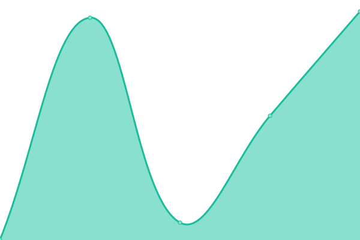

# [📈 Live Status](https://upptime.outercore.ai): <!--live status--> **🟩 All systems operational**

This repository contains the open-source uptime monitor and status page for [chase.fil](https://upptime.outercore.ai), powered by [Upptime](https://github.com/upptime/upptime).

With [Upptime](https://upptime.js.org), you can get your own unlimited and free uptime monitor and status page, powered entirely by a GitHub repository. We use [Issues](https://github.com/vesahc/upptime-pln/issues) as incident reports, [Actions](https://github.com/vesahc/upptime-pln/actions) as uptime monitors, and [Pages](https://upptime.outercore.ai) for the status page.

<!--start: status pages-->
<!-- This summary is generated by Upptime (https://github.com/upptime/upptime) -->
<!-- Do not edit this manually, your changes will be overwritten -->
<!-- prettier-ignore -->
| URL | Status | History | Response Time | Uptime |
| --- | ------ | ------- | ------------- | ------ |
|  [Protocol Labs](https://protocol.ai) | 🟩 Up | [protocol-labs.yml](https://github.com/vesahc/upptime-pln/commits/HEAD/history/protocol-labs.yml) | 

 471ms
     
 | 

<a href="https://upptime.outercore.ai/history/protocol-labs">100.00%</a>
    

|  [Filecoin](https://filecoin.io) | 🟩 Up | [filecoin.yml](https://github.com/vesahc/upptime-pln/commits/HEAD/history/filecoin.yml) | 

 424ms
     
 | 

<a href="https://upptime.outercore.ai/history/filecoin">100.00%</a>
    

|  [IPFS](https://ipfs.tech) | 🟩 Up | [ipfs.yml](https://github.com/vesahc/upptime-pln/commits/HEAD/history/ipfs.yml) | 

 494ms
     
 | 

<a href="https://upptime.outercore.ai/history/ipfs">100.00%</a>
    

|  [libp2p](https://libp2p.io) | 🟩 Up | [libp2p.yml](https://github.com/vesahc/upptime-pln/commits/HEAD/history/libp2p.yml) | 

 518ms
     
 | 

<a href="https://upptime.outercore.ai/history/libp2p">100.00%</a>
    

|  [ipld](https://ipld.io) | 🟩 Up | [ipld.yml](https://github.com/vesahc/upptime-pln/commits/HEAD/history/ipld.yml) | 

 601ms
     
 | 

<a href="https://upptime.outercore.ai/history/ipld">100.00%</a>
    

<!--end: status pages-->

[**Visit our status website →**](https://upptime.outercore.ai)

## 📄 License

- Powered by: [Upptime](https://github.com/upptime/upptime)
- Code: [MIT](./LICENSE) © [chase.fil](https://upptime.outercore.ai)
- Data in the `./history` directory: [Open Database License](https://opendatacommons.org/licenses/odbl/1-0/)
