# [📈 Live Status](https://upptime.outercore.ai): <!--live status--> **🟧 Partial outage**

This repository contains the open-source uptime monitor and status page for [Protocol Labs](https://upptime.outercore.ai), powered by [Upptime](https://github.com/upptime/upptime).

The [Airtable Interface](https://airtable.com/invite/l?inviteId=invVgVQUtAq60QRrA&inviteToken=db142bb642208b5ba9943e1c02ddb083db68ceef4bf45667fa7a2dd17c136b48&utm_medium=email&utm_source=product_team&utm_content=transactional-alerts) can be used to create a Pull Request to Add or Omit monitoring for specific sites, as well as to add your Github handle to receive notifications for specific sites. Please check the [Upptime Configuration](https://upptime.js.org/docs/configuration) docs for more advanced config options, some of which are included in the Airtable interface.

Do not add sites that do not exist in Airtable. They will be overwritten by an automated flow that happens weekly (currently) which collects known active domains via API. Open an issue, or contact @vesahc (@chase.fil on Slack) if you would like to add additional data sources.

Global notifications are posted to the [#upptime-pln](https://filecoinproject.slack.com/archives/C05NN527TS7) channel on Filecoin Slack.

With [Upptime](https://upptime.js.org), you can get your own unlimited and free uptime monitor and status page, powered entirely by a GitHub repository. We use [Issues](https://github.com/vesahc/upptime-pln/issues) as incident reports, [Actions](https://github.com/vesahc/upptime-pln/actions) as uptime monitors, and [Pages](https://upptime.outercore.ai) for the status page.

<!--start: status pages-->
<!-- This summary is generated by Upptime (https://github.com/upptime/upptime) -->
<!-- Do not edit this manually, your changes will be overwritten -->
<!-- prettier-ignore -->
| URL | Status | History | Response Time | Uptime |
| --- | ------ | ------- | ------------- | ------ |
|  [2019.ipfs.camp](https://2019.ipfs.camp) | 🟩 Up | [2019-ipfs-camp.yml](https://github.com/protocol/upptime-pln/commits/HEAD/history/2019-ipfs-camp.yml) | 

 1296ms
     
 | 

<a href="https://upptime.outercore.ai/history/2019-ipfs-camp">99.94%</a>
    

|  [2022.ipfs-thing.events](https://2022.ipfs-thing.events) | 🟩 Up | [2022-ipfs-thing-events.yml](https://github.com/protocol/upptime-pln/commits/HEAD/history/2022-ipfs-thing-events.yml) | 

 762ms
     
 | 

<a href="https://upptime.outercore.ai/history/2022-ipfs-thing-events">99.77%</a>
    

|  [2022.ipfs-thing.io](https://2022.ipfs-thing.io) | 🟩 Up | [2022-ipfs-thing-io.yml](https://github.com/protocol/upptime-pln/commits/HEAD/history/2022-ipfs-thing-io.yml) | 

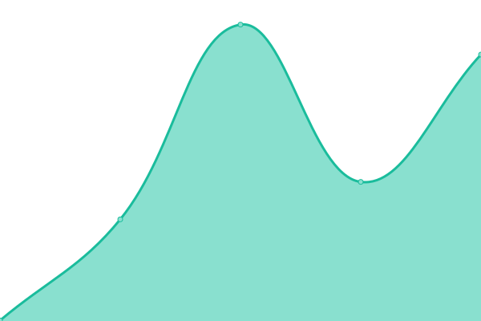 453ms
     
 | 

<a href="https://upptime.outercore.ai/history/2022-ipfs-thing-io">99.77%</a>
    

|  [2022.ipfs.camp](https://2022.ipfs.camp) | 🟩 Up | [2022-ipfs-camp.yml](https://github.com/protocol/upptime-pln/commits/HEAD/history/2022-ipfs-camp.yml) | 

 1506ms
     
 | 

<a href="https://upptime.outercore.ai/history/2022-ipfs-camp">100.00%</a>
    

|  [2023.ipfs-thing.io](https://2023.ipfs-thing.io) | 🟩 Up | [2023-ipfs-thing-io.yml](https://github.com/protocol/upptime-pln/commits/HEAD/history/2023-ipfs-thing-io.yml) | 

 1494ms
     
 | 

<a href="https://upptime.outercore.ai/history/2023-ipfs-thing-io">100.00%</a>
    

|  [22.labweek.io](https://22.labweek.io) | 🟩 Up | [22-labweek-io.yml](https://github.com/protocol/upptime-pln/commits/HEAD/history/22-labweek-io.yml) | 

 269ms
     
 | 

<a href="https://upptime.outercore.ai/history/22-labweek-io">100.00%</a>
    

|  [ar.dev.wikipedia-on-ipfs.org](https://ar.dev.wikipedia-on-ipfs.org) | 🟩 Up | [ar-dev-wikipedia-on-ipfs-org.yml](https://github.com/protocol/upptime-pln/commits/HEAD/history/ar-dev-wikipedia-on-ipfs-org.yml) | 

 956ms
     
 | 

<a href="https://upptime.outercore.ai/history/ar-dev-wikipedia-on-ipfs-org">100.00%</a>
    

|  [ar.wikipedia-on-ipfs.org](https://ar.wikipedia-on-ipfs.org) | 🟩 Up | [ar-wikipedia-on-ipfs-org.yml](https://github.com/protocol/upptime-pln/commits/HEAD/history/ar-wikipedia-on-ipfs-org.yml) | 

 613ms
     
 | 

<a href="https://upptime.outercore.ai/history/ar-wikipedia-on-ipfs-org">100.00%</a>
    

|  [archive.discuss.filecoin.io](https://archive.discuss.filecoin.io) | 🟥 Down | [archive-discuss-filecoin-io.yml](https://github.com/protocol/upptime-pln/commits/HEAD/history/archive-discuss-filecoin-io.yml) | 

 0ms
     
 | 

<a href="https://upptime.outercore.ai/history/archive-discuss-filecoin-io">0.00%</a>
    

|  [arewedistributedyet.com](https://arewedistributedyet.com) | 🟩 Up | [arewedistributedyet-com.yml](https://github.com/protocol/upptime-pln/commits/HEAD/history/arewedistributedyet-com.yml) | 

 604ms
     
 | 

<a href="https://upptime.outercore.ai/history/arewedistributedyet-com">99.77%</a>
    

|  [areweinterplanetaryyet.org](https://areweinterplanetaryyet.org) | 🟩 Up | [areweinterplanetaryyet-org.yml](https://github.com/protocol/upptime-pln/commits/HEAD/history/areweinterplanetaryyet-org.yml) | 

 1176ms
     
 | 

<a href="https://upptime.outercore.ai/history/areweinterplanetaryyet-org">99.94%</a>
    

|  [arg.protocol.ai](https://arg.protocol.ai) | 🟩 Up | [arg-protocol-ai.yml](https://github.com/protocol/upptime-pln/commits/HEAD/history/arg-protocol-ai.yml) | 

 915ms
     
 | 

<a href="https://upptime.outercore.ai/history/arg-protocol-ai">100.00%</a>
    

|  [awesome.ipfs.tech](https://awesome.ipfs.tech) | 🟩 Up | [awesome-ipfs-tech.yml](https://github.com/protocol/upptime-pln/commits/HEAD/history/awesome-ipfs-tech.yml) | 

 173ms
     
 | 

<a href="https://upptime.outercore.ai/history/awesome-ipfs-tech">100.00%</a>
    

|  [badbits.dwebops.pub](https://badbits.dwebops.pub) | 🟩 Up | [badbits-dwebops-pub.yml](https://github.com/protocol/upptime-pln/commits/HEAD/history/badbits-dwebops-pub.yml) | 

 591ms
     
 | 

<a href="https://upptime.outercore.ai/history/badbits-dwebops-pub">100.00%</a>
    

|  [benchmark-js.ipfs.io](https://benchmark-js.ipfs.io) | 🟩 Up | [benchmark-js-ipfs-io.yml](https://github.com/protocol/upptime-pln/commits/HEAD/history/benchmark-js-ipfs-io.yml) | 

 419ms
     
 | 

<a href="https://upptime.outercore.ai/history/benchmark-js-ipfs-io">100.00%</a>
    

|  [blocks.ipfs.io](https://blocks.ipfs.io) | 🟩 Up | [blocks-ipfs-io.yml](https://github.com/protocol/upptime-pln/commits/HEAD/history/blocks-ipfs-io.yml) | 

 499ms
     
 | 

<a href="https://upptime.outercore.ai/history/blocks-ipfs-io">100.00%</a>
    

|  [blog.ipfs.io](https://blog.ipfs.io) | 🟩 Up | [blog-ipfs-io.yml](https://github.com/protocol/upptime-pln/commits/HEAD/history/blog-ipfs-io.yml) | 

 312ms
     
 | 

<a href="https://upptime.outercore.ai/history/blog-ipfs-io">100.00%</a>
    

|  [blog.ipfs.tech](https://blog.ipfs.tech) | 🟩 Up | [blog-ipfs-tech.yml](https://github.com/protocol/upptime-pln/commits/HEAD/history/blog-ipfs-tech.yml) | 

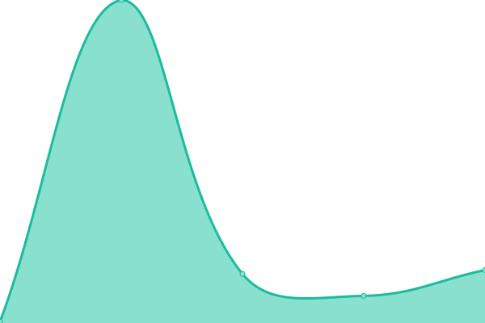 15ms
     
 | 

<a href="https://upptime.outercore.ai/history/blog-ipfs-tech">100.00%</a>
    

|  [blog.libp2p.io](https://blog.libp2p.io) | 🟩 Up | [blog-libp2p-io.yml](https://github.com/protocol/upptime-pln/commits/HEAD/history/blog-libp2p-io.yml) | 

 457ms
     
 | 

<a href="https://upptime.outercore.ai/history/blog-libp2p-io">100.00%</a>
    

|  [boost.filecoin.io](https://boost.filecoin.io) | 🟩 Up | [boost-filecoin-io.yml](https://github.com/protocol/upptime-pln/commits/HEAD/history/boost-filecoin-io.yml) | 

 257ms
     
 | 

<a href="https://upptime.outercore.ai/history/boost-filecoin-io">100.00%</a>
    

|  [boston23.sbs.tech](https://boston23.sbs.tech) | 🟩 Up | [boston23-sbs-tech.yml](https://github.com/protocol/upptime-pln/commits/HEAD/history/boston23-sbs-tech.yml) | 

 417ms
     
 | 

<a href="https://upptime.outercore.ai/history/boston23-sbs-tech">100.00%</a>
    

|  [breakthroughs-in-computing.labweek.io](https://breakthroughs-in-computing.labweek.io) | 🟥 Down | [breakthroughs-in-computing-labweek-io.yml](https://github.com/protocol/upptime-pln/commits/HEAD/history/breakthroughs-in-computing-labweek-io.yml) | 

 314ms
     
 | 

<a href="https://upptime.outercore.ai/history/breakthroughs-in-computing-labweek-io">0.00%</a>
    

|  [buildingweb3.com](https://buildingweb3.com) | 🟥 Down | [buildingweb3-com.yml](https://github.com/protocol/upptime-pln/commits/HEAD/history/buildingweb3-com.yml) | 

 1341ms
     
 | 

<a href="https://upptime.outercore.ai/history/buildingweb3-com">73.89%</a>
    

|  [car.ipfs.io](https://car.ipfs.io) | 🟩 Up | [car-ipfs-io.yml](https://github.com/protocol/upptime-pln/commits/HEAD/history/car-ipfs-io.yml) | 

 607ms
     
 | 

<a href="https://upptime.outercore.ai/history/car-ipfs-io">99.77%</a>
    

|  [check.ipfs.network](https://check.ipfs.network) | 🟩 Up | [check-ipfs-network.yml](https://github.com/protocol/upptime-pln/commits/HEAD/history/check-ipfs-network.yml) | 

 627ms
     
 | 

<a href="https://upptime.outercore.ai/history/check-ipfs-network">99.77%</a>
    

|  [cid.ipfs.io](https://cid.ipfs.io) | 🟩 Up | [cid-ipfs-io.yml](https://github.com/protocol/upptime-pln/commits/HEAD/history/cid-ipfs-io.yml) | 

 526ms
     
 | 

<a href="https://upptime.outercore.ai/history/cid-ipfs-io">99.77%</a>
    

|  [cid.ipfs.tech](https://cid.ipfs.tech) | 🟩 Up | [cid-ipfs-tech.yml](https://github.com/protocol/upptime-pln/commits/HEAD/history/cid-ipfs-tech.yml) | 

 352ms
     
 | 

<a href="https://upptime.outercore.ai/history/cid-ipfs-tech">99.77%</a>
    

|  [collab.ipfscluster.io](https://collab.ipfscluster.io) | 🟩 Up | [collab-ipfscluster-io.yml](https://github.com/protocol/upptime-pln/commits/HEAD/history/collab-ipfscluster-io.yml) | 

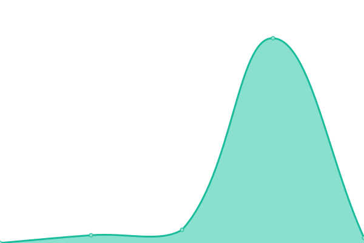 272ms
     
 | 

<a href="https://upptime.outercore.ai/history/collab-ipfscluster-io">100.00%</a>
    

|  [conformance.ipfs.tech](https://conformance.ipfs.tech) | 🟩 Up | [conformance-ipfs-tech.yml](https://github.com/protocol/upptime-pln/commits/HEAD/history/conformance-ipfs-tech.yml) | 

 358ms
     
 | 

<a href="https://upptime.outercore.ai/history/conformance-ipfs-tech">100.00%</a>
    

|  [connectivity.libp2p.io](https://connectivity.libp2p.io) | 🟩 Up | [connectivity-libp2p-io.yml](https://github.com/protocol/upptime-pln/commits/HEAD/history/connectivity-libp2p-io.yml) | 

 657ms
     
 | 

<a href="https://upptime.outercore.ai/history/connectivity-libp2p-io">0.00%</a>
    

|  [consensus-factory.io](https://consensus-factory.io) | 🟥 Down | [consensus-factory-io.yml](https://github.com/protocol/upptime-pln/commits/HEAD/history/consensus-factory-io.yml) | 

 0ms
     
 | 

<a href="https://upptime.outercore.ai/history/consensus-factory-io">0.00%</a>
    

|  [cryptoeconlab.io](https://cryptoeconlab.io) | 🟩 Up | [cryptoeconlab-io.yml](https://github.com/protocol/upptime-pln/commits/HEAD/history/cryptoeconlab-io.yml) | 

 499ms
     
 | 

<a href="https://upptime.outercore.ai/history/cryptoeconlab-io">99.88%</a>
    

|  [dag.house](https://dag.house) | 🟩 Up | [dag-house.yml](https://github.com/protocol/upptime-pln/commits/HEAD/history/dag-house.yml) | 

 496ms
     
 | 

<a href="https://upptime.outercore.ai/history/dag-house">100.00%</a>
    

|  [dag.ipfs.io](https://dag.ipfs.io) | 🟩 Up | [dag-ipfs-io.yml](https://github.com/protocol/upptime-pln/commits/HEAD/history/dag-ipfs-io.yml) | 

 566ms
     
 | 

<a href="https://upptime.outercore.ai/history/dag-ipfs-io">99.77%</a>
    

|  [dag.ipfs.tech](https://dag.ipfs.tech) | 🟩 Up | [dag-ipfs-tech.yml](https://github.com/protocol/upptime-pln/commits/HEAD/history/dag-ipfs-tech.yml) | 

 236ms
     
 | 

<a href="https://upptime.outercore.ai/history/dag-ipfs-tech">99.77%</a>
    

|  [data.storage.market](https://data.storage.market) | 🟥 Down | [data-storage-market.yml](https://github.com/protocol/upptime-pln/commits/HEAD/history/data-storage-market.yml) | 

 819ms
     
 | 

<a href="https://upptime.outercore.ai/history/data-storage-market">0.00%</a>
    

|  [datacapstats.io](https://datacapstats.io) | 🟩 Up | [datacapstats-io.yml](https://github.com/protocol/upptime-pln/commits/HEAD/history/datacapstats-io.yml) | 

 267ms
     
 | 

<a href="https://upptime.outercore.ai/history/datacapstats-io">100.00%</a>
    

|  [dataprograms.org](https://dataprograms.org) | 🟩 Up | [dataprograms-org.yml](https://github.com/protocol/upptime-pln/commits/HEAD/history/dataprograms-org.yml) | 

 476ms
     
 | 

<a href="https://upptime.outercore.ai/history/dataprograms-org">100.00%</a>
    

|  [datasets.filecoin.io](https://datasets.filecoin.io) | 🟩 Up | [datasets-filecoin-io.yml](https://github.com/protocol/upptime-pln/commits/HEAD/history/datasets-filecoin-io.yml) | 

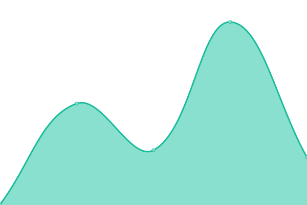 266ms
     
 | 

<a href="https://upptime.outercore.ai/history/datasets-filecoin-io">100.00%</a>
    

|  [datatogether.org](https://datatogether.org) | 🟩 Up | [datatogether-org.yml](https://github.com/protocol/upptime-pln/commits/HEAD/history/datatogether-org.yml) | 

 271ms
     
 | 

<a href="https://upptime.outercore.ai/history/datatogether-org">100.00%</a>
    

|  [delta.store](https://delta.store) | 🟥 Down | [delta-store.yml](https://github.com/protocol/upptime-pln/commits/HEAD/history/delta-store.yml) | 

 0ms
     
 | 

<a href="https://upptime.outercore.ai/history/delta-store">0.00%</a>
    

|  [destor.com](https://destor.com) | 🟩 Up | [destor-com.yml](https://github.com/protocol/upptime-pln/commits/HEAD/history/destor-com.yml) | 

 231ms
     
 | 

<a href="https://upptime.outercore.ai/history/destor-com">100.00%</a>
    

|  [dev.green.filecoin.io](https://dev.green.filecoin.io) | 🟥 Down | [dev-green-filecoin-io.yml](https://github.com/protocol/upptime-pln/commits/HEAD/history/dev-green-filecoin-io.yml) | 

 0ms
     
 | 

<a href="https://upptime.outercore.ai/history/dev-green-filecoin-io">0.00%</a>
    

|  [dev.plnetwork.io](https://dev.plnetwork.io) | 🟩 Up | [dev-plnetwork-io.yml](https://github.com/protocol/upptime-pln/commits/HEAD/history/dev-plnetwork-io.yml) | 

 216ms
     
 | 

<a href="https://upptime.outercore.ai/history/dev-plnetwork-io">100.00%</a>
    

|  [dev.webui.ipfs.io](https://dev.webui.ipfs.io) | 🟩 Up | [dev-webui-ipfs-io.yml](https://github.com/protocol/upptime-pln/commits/HEAD/history/dev-webui-ipfs-io.yml) | 

 431ms
     
 | 

<a href="https://upptime.outercore.ai/history/dev-webui-ipfs-io">100.00%</a>
    

|  [develop.ecosystem.filecoin.io](https://develop.ecosystem.filecoin.io) | 🟥 Down | [develop-ecosystem-filecoin-io.yml](https://github.com/protocol/upptime-pln/commits/HEAD/history/develop-ecosystem-filecoin-io.yml) | 

 0ms
     
 | 

<a href="https://upptime.outercore.ai/history/develop-ecosystem-filecoin-io">0.00%</a>
    

|  [discoursegraphs.ai](https://discoursegraphs.ai) | 🟥 Down | [discoursegraphs-ai.yml](https://github.com/protocol/upptime-pln/commits/HEAD/history/discoursegraphs-ai.yml) | 

 0ms
     
 | 

<a href="https://upptime.outercore.ai/history/discoursegraphs-ai">0.00%</a>
    

|  [discuss.ipfs.tech](https://discuss.ipfs.tech) | 🟩 Up | [discuss-ipfs-tech.yml](https://github.com/protocol/upptime-pln/commits/HEAD/history/discuss-ipfs-tech.yml) | 

 333ms
     
 | 

<a href="https://upptime.outercore.ai/history/discuss-ipfs-tech">100.00%</a>
    

|  [discuss.libp2p.io](https://discuss.libp2p.io) | 🟩 Up | [discuss-libp2p-io.yml](https://github.com/protocol/upptime-pln/commits/HEAD/history/discuss-libp2p-io.yml) | 

 381ms
     
 | 

<a href="https://upptime.outercore.ai/history/discuss-libp2p-io">100.00%</a>
    

|  [dist.ipfs.io](https://dist.ipfs.io) | 🟩 Up | [dist-ipfs-io.yml](https://github.com/protocol/upptime-pln/commits/HEAD/history/dist-ipfs-io.yml) | 

 757ms
     
 | 

<a href="https://upptime.outercore.ai/history/dist-ipfs-io">100.00%</a>
    

|  [dist.ipfs.tech](https://dist.ipfs.tech) | 🟩 Up | [dist-ipfs-tech.yml](https://github.com/protocol/upptime-pln/commits/HEAD/history/dist-ipfs-tech.yml) | 

 141ms
     
 | 

<a href="https://upptime.outercore.ai/history/dist-ipfs-tech">100.00%</a>
    

|  [dnslink.io](https://dnslink.io) | 🟩 Up | [dnslink-io.yml](https://github.com/protocol/upptime-pln/commits/HEAD/history/dnslink-io.yml) | 

 574ms
     
 | 

<a href="https://upptime.outercore.ai/history/dnslink-io">99.85%</a>
    

|  [dnslink.org](https://dnslink.org) | 🟩 Up | [dnslink-org.yml](https://github.com/protocol/upptime-pln/commits/HEAD/history/dnslink-org.yml) | 

 746ms
     
 | 

<a href="https://upptime.outercore.ai/history/dnslink-org">99.85%</a>
    

|  [docs.filecoin.io](https://docs.filecoin.io) | 🟩 Up | [docs-filecoin-io.yml](https://github.com/protocol/upptime-pln/commits/HEAD/history/docs-filecoin-io.yml) | 

 97ms
     
 | 

<a href="https://upptime.outercore.ai/history/docs-filecoin-io">100.00%</a>
    

|  [docs.ipfs.io](https://docs.ipfs.io) | 🟩 Up | [docs-ipfs-io.yml](https://github.com/protocol/upptime-pln/commits/HEAD/history/docs-ipfs-io.yml) | 

 388ms
     
 | 

<a href="https://upptime.outercore.ai/history/docs-ipfs-io">0.00%</a>
    

|  [docs.ipfs.tech](https://docs.ipfs.tech) | 🟩 Up | [docs-ipfs-tech.yml](https://github.com/protocol/upptime-pln/commits/HEAD/history/docs-ipfs-tech.yml) | 

 17ms
     
 | 

<a href="https://upptime.outercore.ai/history/docs-ipfs-tech">0.00%</a>
    

|  [docs.libp2p.io](https://docs.libp2p.io) | 🟩 Up | [docs-libp2p-io.yml](https://github.com/protocol/upptime-pln/commits/HEAD/history/docs-libp2p-io.yml) | 

 393ms
     
 | 

<a href="https://upptime.outercore.ai/history/docs-libp2p-io">100.00%</a>
    

|  [docs.testground.ai](https://docs.testground.ai) | 🟩 Up | [docs-testground-ai.yml](https://github.com/protocol/upptime-pln/commits/HEAD/history/docs-testground-ai.yml) | 

 258ms
     
 | 

<a href="https://upptime.outercore.ai/history/docs-testground-ai">100.00%</a>
    

|  [drand.love](https://drand.love) | 🟩 Up | [drand-love.yml](https://github.com/protocol/upptime-pln/commits/HEAD/history/drand-love.yml) | 

 250ms
     
 | 

<a href="https://upptime.outercore.ai/history/drand-love">100.00%</a>
    

|  [dweb-primer.ipfs.io](https://dweb-primer.ipfs.io) | 🟩 Up | [dweb-primer-ipfs-io.yml](https://github.com/protocol/upptime-pln/commits/HEAD/history/dweb-primer-ipfs-io.yml) | 

 205ms
     
 | 

<a href="https://upptime.outercore.ai/history/dweb-primer-ipfs-io">100.00%</a>
    

|  [earth23.sbs.tech](https://earth23.sbs.tech) | 🟩 Up | [earth23-sbs-tech.yml](https://github.com/protocol/upptime-pln/commits/HEAD/history/earth23-sbs-tech.yml) | 

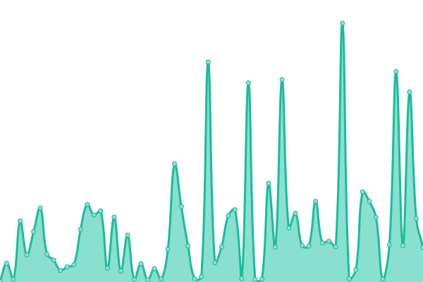 361ms
     
 | 

<a href="https://upptime.outercore.ai/history/earth23-sbs-tech">100.00%</a>
    

|  [ecosystem.ipfs.io](https://ecosystem.ipfs.io) | 🟩 Up | [ecosystem-ipfs-io.yml](https://github.com/protocol/upptime-pln/commits/HEAD/history/ecosystem-ipfs-io.yml) | 

 322ms
     
 | 

<a href="https://upptime.outercore.ai/history/ecosystem-ipfs-io">0.00%</a>
    

|  [ecosystem.ipfs.tech](https://ecosystem.ipfs.tech) | 🟩 Up | [ecosystem-ipfs-tech.yml](https://github.com/protocol/upptime-pln/commits/HEAD/history/ecosystem-ipfs-tech.yml) | 

 193ms
     
 | 

<a href="https://upptime.outercore.ai/history/ecosystem-ipfs-tech">100.00%</a>
    

|  [elegant-glowing.plnetwork.io](https://elegant-glowing.plnetwork.io) | 🟩 Up | [elegant-glowing-plnetwork-io.yml](https://github.com/protocol/upptime-pln/commits/HEAD/history/elegant-glowing-plnetwork-io.yml) | 

 384ms
     
 | 

<a href="https://upptime.outercore.ai/history/elegant-glowing-plnetwork-io">100.00%</a>
    

|  [en.dev.wikipedia-on-ipfs.org](https://en.dev.wikipedia-on-ipfs.org) | 🟩 Up | [en-dev-wikipedia-on-ipfs-org.yml](https://github.com/protocol/upptime-pln/commits/HEAD/history/en-dev-wikipedia-on-ipfs-org.yml) | 

 667ms
     
 | 

<a href="https://upptime.outercore.ai/history/en-dev-wikipedia-on-ipfs-org">100.00%</a>
    

|  [en.wikipedia-on-ipfs.org](https://en.wikipedia-on-ipfs.org) | 🟩 Up | [en-wikipedia-on-ipfs-org.yml](https://github.com/protocol/upptime-pln/commits/HEAD/history/en-wikipedia-on-ipfs-org.yml) | 

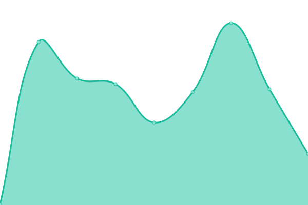 476ms
     
 | 

<a href="https://upptime.outercore.ai/history/en-wikipedia-on-ipfs-org">100.00%</a>
    

|  [estuary.tech](https://estuary.tech) | 🟩 Up | [estuary-tech.yml](https://github.com/protocol/upptime-pln/commits/HEAD/history/estuary-tech.yml) | 

 364ms
     
 | 

<a href="https://upptime.outercore.ai/history/estuary-tech">99.94%</a>
    

|  [ethdenver.ipc.space](https://ethdenver.ipc.space) | 🟥 Down | [ethdenver-ipc-space.yml](https://github.com/protocol/upptime-pln/commits/HEAD/history/ethdenver-ipc-space.yml) | 

 0ms
     
 | 

<a href="https://upptime.outercore.ai/history/ethdenver-ipc-space">0.00%</a>
    

|  [events.plnetwork.io](https://events.plnetwork.io) | 🟩 Up | [events-plnetwork-io.yml](https://github.com/protocol/upptime-pln/commits/HEAD/history/events-plnetwork-io.yml) | 

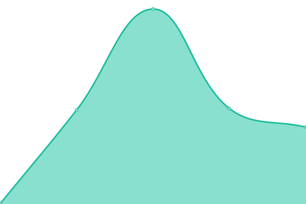 1218ms
     
 | 

<a href="https://upptime.outercore.ai/history/events-plnetwork-io">100.00%</a>
    

|  [evergreen.filecoin.io](https://evergreen.filecoin.io) | 🟩 Up | [evergreen-filecoin-io.yml](https://github.com/protocol/upptime-pln/commits/HEAD/history/evergreen-filecoin-io.yml) | 

 253ms
     
 | 

<a href="https://upptime.outercore.ai/history/evergreen-filecoin-io">99.94%</a>
    

|  [explore.ipld.io](https://explore.ipld.io) | 🟩 Up | [explore-ipld-io.yml](https://github.com/protocol/upptime-pln/commits/HEAD/history/explore-ipld-io.yml) | 

 657ms
     
 | 

<a href="https://upptime.outercore.ai/history/explore-ipld-io">99.85%</a>
    

|  [fa.wikipedia-on-ipfs.org](https://fa.wikipedia-on-ipfs.org) | 🟩 Up | [fa-wikipedia-on-ipfs-org.yml](https://github.com/protocol/upptime-pln/commits/HEAD/history/fa-wikipedia-on-ipfs-org.yml) | 

 521ms
     
 | 

<a href="https://upptime.outercore.ai/history/fa-wikipedia-on-ipfs-org">100.00%</a>
    

|  [fil-safts.com](https://fil-safts.com) | 🟩 Up | [fil-safts-com.yml](https://github.com/protocol/upptime-pln/commits/HEAD/history/fil-safts-com.yml) | 

 2214ms
     
 | 

<a href="https://upptime.outercore.ai/history/fil-safts-com">99.86%</a>
    

|  [fil.page](https://fil.page) | 🟩 Up | [fil-page.yml](https://github.com/protocol/upptime-pln/commits/HEAD/history/fil-page.yml) | 

 310ms
     
 | 

<a href="https://upptime.outercore.ai/history/fil-page">0.00%</a>
    

|  [fildev.io](https://fildev.io) | 🟩 Up | [fildev-io.yml](https://github.com/protocol/upptime-pln/commits/HEAD/history/fildev-io.yml) | 

 4361ms
     
 | 

<a href="https://upptime.outercore.ai/history/fildev-io">99.95%</a>
    

|  [file.app](https://file.app) | 🟥 Down | [file-app.yml](https://github.com/protocol/upptime-pln/commits/HEAD/history/file-app.yml) | 

 0ms
     
 | 

<a href="https://upptime.outercore.ai/history/file-app">0.00%</a>
    

|  [filecoin-discover.com](https://filecoin-discover.com) | 🟩 Up | [filecoin-discover-com.yml](https://github.com/protocol/upptime-pln/commits/HEAD/history/filecoin-discover-com.yml) | 

 206ms
     
 | 

<a href="https://upptime.outercore.ai/history/filecoin-discover-com">100.00%</a>
    

|  [filecoin-explorer.com](https://filecoin-explorer.com) | 🟩 Up | [filecoin-explorer-com.yml](https://github.com/protocol/upptime-pln/commits/HEAD/history/filecoin-explorer-com.yml) | 

 168ms
     
 | 

<a href="https://upptime.outercore.ai/history/filecoin-explorer-com">100.00%</a>
    

|  [filecoin-tracker.com](https://filecoin-tracker.com) | 🟥 Down | [filecoin-tracker-com.yml](https://github.com/protocol/upptime-pln/commits/HEAD/history/filecoin-tracker-com.yml) | 

 260ms
     
 | 

<a href="https://upptime.outercore.ai/history/filecoin-tracker-com">0.00%</a>
    

|  [filecoin.io](https://filecoin.io) | 🟩 Up | [filecoin-io.yml](https://github.com/protocol/upptime-pln/commits/HEAD/history/filecoin-io.yml) | 

 146ms
     
 | 

<a href="https://upptime.outercore.ai/history/filecoin-io">100.00%</a>
    

|  [filecoindata.tools](https://filecoindata.tools) | 🟩 Up | [filecoindata-tools.yml](https://github.com/protocol/upptime-pln/commits/HEAD/history/filecoindata-tools.yml) | 

 341ms
     
 | 

<a href="https://upptime.outercore.ai/history/filecoindata-tools">100.00%</a>
    

|  [filecoinecosystem.io](https://filecoinecosystem.io) | 🟩 Up | [filecoinecosystem-io.yml](https://github.com/protocol/upptime-pln/commits/HEAD/history/filecoinecosystem-io.yml) | 

 905ms
     
 | 

<a href="https://upptime.outercore.ai/history/filecoinecosystem-io">100.00%</a>
    

|  [filecoingreen.io](https://filecoingreen.io) | 🟥 Down | [filecoingreen-io.yml](https://github.com/protocol/upptime-pln/commits/HEAD/history/filecoingreen-io.yml) | 

 0ms
     
 | 

<a href="https://upptime.outercore.ai/history/filecoingreen-io">0.00%</a>
    

|  [filecointldr.io](https://filecointldr.io) | 🟩 Up | [filecointldr-io.yml](https://github.com/protocol/upptime-pln/commits/HEAD/history/filecointldr-io.yml) | 

 1363ms
     
 | 

<a href="https://upptime.outercore.ai/history/filecointldr-io">100.00%</a>
    

|  [filecoinunleashed.io](https://filecoinunleashed.io) | 🟥 Down | [filecoinunleashed-io.yml](https://github.com/protocol/upptime-pln/commits/HEAD/history/filecoinunleashed-io.yml) | 

 677ms
     
 | 

<a href="https://upptime.outercore.ai/history/filecoinunleashed-io">0.00%</a>
    

|  [filplus.storage](https://filplus.storage) | 🟩 Up | [filplus-storage.yml](https://github.com/protocol/upptime-pln/commits/HEAD/history/filplus-storage.yml) | 

 638ms
     
 | 

<a href="https://upptime.outercore.ai/history/filplus-storage">100.00%</a>
    

|  [filpoll.io](https://filpoll.io) | 🟥 Down | [filpoll-io.yml](https://github.com/protocol/upptime-pln/commits/HEAD/history/filpoll-io.yml) | 

 0ms
     
 | 

<a href="https://upptime.outercore.ai/history/filpoll-io">0.00%</a>
    

|  [filspark.com](https://filspark.com) | 🟩 Up | [filspark-com.yml](https://github.com/protocol/upptime-pln/commits/HEAD/history/filspark-com.yml) | 

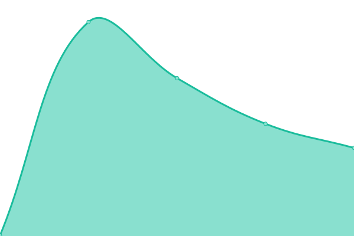 265ms
     
 | 

<a href="https://upptime.outercore.ai/history/filspark-com">100.00%</a>
    

|  [fips.filecoin.io](https://fips.filecoin.io) | 🟩 Up | [fips-filecoin-io.yml](https://github.com/protocol/upptime-pln/commits/HEAD/history/fips-filecoin-io.yml) | 

 267ms
     
 | 

<a href="https://upptime.outercore.ai/history/fips-filecoin-io">99.88%</a>
    

|  [flipchart.peerpad.net](https://flipchart.peerpad.net) | 🟩 Up | [flipchart-peerpad-net.yml](https://github.com/protocol/upptime-pln/commits/HEAD/history/flipchart-peerpad-net.yml) | 

 468ms
     
 | 

<a href="https://upptime.outercore.ai/history/flipchart-peerpad-net">100.00%</a>
    

|  [fvm.filecoin.io](https://fvm.filecoin.io) | 🟩 Up | [fvm-filecoin-io.yml](https://github.com/protocol/upptime-pln/commits/HEAD/history/fvm-filecoin-io.yml) | 

 352ms
     
 | 

<a href="https://upptime.outercore.ai/history/fvm-filecoin-io">100.00%</a>
    

|  [grants.filecoin.io](https://grants.filecoin.io) | 🟩 Up | [grants-filecoin-io.yml](https://github.com/protocol/upptime-pln/commits/HEAD/history/grants-filecoin-io.yml) | 

 411ms
     
 | 

<a href="https://upptime.outercore.ai/history/grants-filecoin-io">99.92%</a>
    

|  [grants.protocol.ai](https://grants.protocol.ai) | 🟥 Down | [grants-protocol-ai.yml](https://github.com/protocol/upptime-pln/commits/HEAD/history/grants-protocol-ai.yml) | 

 0ms
     
 | 

<a href="https://upptime.outercore.ai/history/grants-protocol-ai">0.00%</a>
    

|  [green.filecoin.io](https://green.filecoin.io) | 🟩 Up | [green-filecoin-io.yml](https://github.com/protocol/upptime-pln/commits/HEAD/history/green-filecoin-io.yml) | 

 300ms
     
 | 

<a href="https://upptime.outercore.ai/history/green-filecoin-io">99.94%</a>
    

|  [hackathons.filecoin.io](https://hackathons.filecoin.io) | 🟩 Up | [hackathons-filecoin-io.yml](https://github.com/protocol/upptime-pln/commits/HEAD/history/hackathons-filecoin-io.yml) | 

 630ms
     
 | 

<a href="https://upptime.outercore.ai/history/hackathons-filecoin-io">99.85%</a>
    

|  [helia.io](https://helia.io) | 🟩 Up | [helia-io.yml](https://github.com/protocol/upptime-pln/commits/HEAD/history/helia-io.yml) | 

 430ms
     
 | 

<a href="https://upptime.outercore.ai/history/helia-io">100.00%</a>
    

|  [igis.io](https://igis.io) | 🟩 Up | [igis-io.yml](https://github.com/protocol/upptime-pln/commits/HEAD/history/igis-io.yml) | 

 536ms
     
 | 

<a href="https://upptime.outercore.ai/history/igis-io">100.00%</a>
    

|  [impactevaluator.io](https://impactevaluator.io) | 🟩 Up | [impactevaluator-io.yml](https://github.com/protocol/upptime-pln/commits/HEAD/history/impactevaluator-io.yml) | 

 225ms
     
 | 

<a href="https://upptime.outercore.ai/history/impactevaluator-io">100.00%</a>
    

|  [ipfs-thing.events](https://ipfs-thing.events) | 🟩 Up | [ipfs-thing-events.yml](https://github.com/protocol/upptime-pln/commits/HEAD/history/ipfs-thing-events.yml) | 

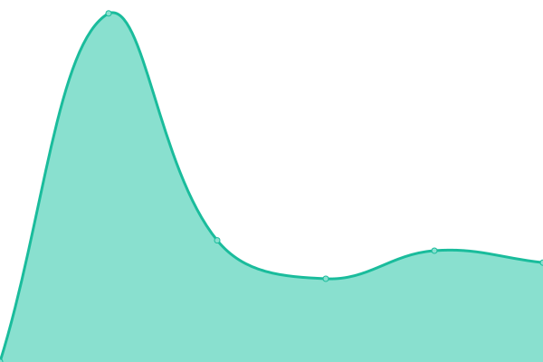 685ms
     
 | 

<a href="https://upptime.outercore.ai/history/ipfs-thing-events">99.85%</a>
    

|  [ipfs.impactevaluator.io](https://ipfs.impactevaluator.io) | 🟩 Up | [ipfs-impactevaluator-io.yml](https://github.com/protocol/upptime-pln/commits/HEAD/history/ipfs-impactevaluator-io.yml) | 

 196ms
     
 | 

<a href="https://upptime.outercore.ai/history/ipfs-impactevaluator-io">100.00%</a>
    

|  [ipfs.network](https://ipfs.network) | 🟩 Up | [ipfs-network.yml](https://github.com/protocol/upptime-pln/commits/HEAD/history/ipfs-network.yml) | 

 491ms
     
 | 

<a href="https://upptime.outercore.ai/history/ipfs-network">100.00%</a>
    

|  [ipfs.tech](https://ipfs.tech) | 🟩 Up | [ipfs-tech.yml](https://github.com/protocol/upptime-pln/commits/HEAD/history/ipfs-tech.yml) | 

 91ms
     
 | 

<a href="https://upptime.outercore.ai/history/ipfs-tech">100.00%</a>
    

|  [ipfscluster.io](https://ipfscluster.io) | 🟩 Up | [ipfscluster-io.yml](https://github.com/protocol/upptime-pln/commits/HEAD/history/ipfscluster-io.yml) | 

 665ms
     
 | 

<a href="https://upptime.outercore.ai/history/ipfscluster-io">100.00%</a>
    

|  [ipfsevents.io](https://ipfsevents.io) | 🟩 Up | [ipfsevents-io.yml](https://github.com/protocol/upptime-pln/commits/HEAD/history/ipfsevents-io.yml) | 

 338ms
     
 | 

<a href="https://upptime.outercore.ai/history/ipfsevents-io">100.00%</a>
    

|  [ipfspinningsummit.com](https://ipfspinningsummit.com) | 🟩 Up | [ipfspinningsummit-com.yml](https://github.com/protocol/upptime-pln/commits/HEAD/history/ipfspinningsummit-com.yml) | 

 1150ms
     
 | 

<a href="https://upptime.outercore.ai/history/ipfspinningsummit-com">99.94%</a>
    

|  [ipld.io](https://ipld.io) | 🟩 Up | [ipld-io.yml](https://github.com/protocol/upptime-pln/commits/HEAD/history/ipld-io.yml) | 

 710ms
     
 | 

<a href="https://upptime.outercore.ai/history/ipld-io">99.85%</a>
    

|  [istanbul.ipc.space](https://istanbul.ipc.space) | 🟥 Down | [istanbul-ipc-space.yml](https://github.com/protocol/upptime-pln/commits/HEAD/history/istanbul-ipc-space.yml) | 

 0ms
     
 | 

<a href="https://upptime.outercore.ai/history/istanbul-ipc-space">0.00%</a>
    

|  [js.ipfs.io](https://js.ipfs.io) | 🟥 Down | [js-ipfs-io.yml](https://github.com/protocol/upptime-pln/commits/HEAD/history/js-ipfs-io.yml) | 

 0ms
     
 | 

<a href="https://upptime.outercore.ai/history/js-ipfs-io">0.00%</a>
    

|  [js.ipfs.tech](https://js.ipfs.tech) | 🟩 Up | [js-ipfs-tech.yml](https://github.com/protocol/upptime-pln/commits/HEAD/history/js-ipfs-tech.yml) | 

 348ms
     
 | 

<a href="https://upptime.outercore.ai/history/js-ipfs-tech">99.86%</a>
    

|  [latam22.sbs.tech](https://latam22.sbs.tech) | 🟩 Up | [latam22-sbs-tech.yml](https://github.com/protocol/upptime-pln/commits/HEAD/history/latam22-sbs-tech.yml) | 

 422ms
     
 | 

<a href="https://upptime.outercore.ai/history/latam22-sbs-tech">100.00%</a>
    

|  [legacy.datasets.filecoin.io](https://legacy.datasets.filecoin.io) | 🟥 Down | [legacy-datasets-filecoin-io.yml](https://github.com/protocol/upptime-pln/commits/HEAD/history/legacy-datasets-filecoin-io.yml) | 

 0ms
     
 | 

<a href="https://upptime.outercore.ai/history/legacy-datasets-filecoin-io">0.00%</a>
    

|  [legacy.starmap.site](https://legacy.starmap.site) | 🟩 Up | [legacy-starmap-site.yml](https://github.com/protocol/upptime-pln/commits/HEAD/history/legacy-starmap-site.yml) | 

 4984ms
     
 | 

<a href="https://upptime.outercore.ai/history/legacy-starmap-site">100.00%</a>
    

|  [libp2p.io](https://libp2p.io) | 🟩 Up | [libp2p-io.yml](https://github.com/protocol/upptime-pln/commits/HEAD/history/libp2p-io.yml) | 

 391ms
     
 | 

<a href="https://upptime.outercore.ai/history/libp2p-io">100.00%</a>
    

|  [liftoff.filecoin.io](https://liftoff.filecoin.io) | 🟩 Up | [liftoff-filecoin-io.yml](https://github.com/protocol/upptime-pln/commits/HEAD/history/liftoff-filecoin-io.yml) | 

 293ms
     
 | 

<a href="https://upptime.outercore.ai/history/liftoff-filecoin-io">99.89%</a>
    

|  [lilium.sh](https://lilium.sh) | 🟩 Up | [lilium-sh.yml](https://github.com/protocol/upptime-pln/commits/HEAD/history/lilium-sh.yml) | 

 348ms
     
 | 

<a href="https://upptime.outercore.ai/history/lilium-sh">100.00%</a>
    

|  [lotus.filecoin.io](https://lotus.filecoin.io) | 🟩 Up | [lotus-filecoin-io.yml](https://github.com/protocol/upptime-pln/commits/HEAD/history/lotus-filecoin-io.yml) | 

 411ms
     
 | 

<a href="https://upptime.outercore.ai/history/lotus-filecoin-io">100.00%</a>
    

|  [microgen.site](https://microgen.site) | 🟩 Up | [microgen-site.yml](https://github.com/protocol/upptime-pln/commits/HEAD/history/microgen-site.yml) | 

 395ms
     
 | 

<a href="https://upptime.outercore.ai/history/microgen-site">100.00%</a>
    

|  [mta-sts.destor.com](https://mta-sts.destor.com) | 🟥 Down | [mta-sts-destor-com.yml](https://github.com/protocol/upptime-pln/commits/HEAD/history/mta-sts-destor-com.yml) | 

 0ms
     
 | 

<a href="https://upptime.outercore.ai/history/mta-sts-destor-com">100.00%</a>
    

|  [multiformats.io](https://multiformats.io) | 🟩 Up | [multiformats-io.yml](https://github.com/protocol/upptime-pln/commits/HEAD/history/multiformats-io.yml) | 

 304ms
     
 | 

<a href="https://upptime.outercore.ai/history/multiformats-io">100.00%</a>
    

|  [my.dev.wikipedia-on-ipfs.org](https://my.dev.wikipedia-on-ipfs.org) | 🟩 Up | [my-dev-wikipedia-on-ipfs-org.yml](https://github.com/protocol/upptime-pln/commits/HEAD/history/my-dev-wikipedia-on-ipfs-org.yml) | 

 1090ms
     
 | 

<a href="https://upptime.outercore.ai/history/my-dev-wikipedia-on-ipfs-org">100.00%</a>
    

|  [my.wikipedia-on-ipfs.org](https://my.wikipedia-on-ipfs.org) | 🟩 Up | [my-wikipedia-on-ipfs-org.yml](https://github.com/protocol/upptime-pln/commits/HEAD/history/my-wikipedia-on-ipfs-org.yml) | 

 515ms
     
 | 

<a href="https://upptime.outercore.ai/history/my-wikipedia-on-ipfs-org">100.00%</a>
    

|  [nft.storage](https://nft.storage) | 🟩 Up | [nft-storage.yml](https://github.com/protocol/upptime-pln/commits/HEAD/history/nft-storage.yml) | 

 412ms
     
 | 

<a href="https://upptime.outercore.ai/history/nft-storage">100.00%</a>
    

|  [nftschool.dev](https://nftschool.dev) | 🟥 Down | [nftschool-dev.yml](https://github.com/protocol/upptime-pln/commits/HEAD/history/nftschool-dev.yml) | 

 0ms
     
 | 

<a href="https://upptime.outercore.ai/history/nftschool-dev">0.00%</a>
    

|  [nftstorage.link](https://nftstorage.link) | 🟩 Up | [nftstorage-link.yml](https://github.com/protocol/upptime-pln/commits/HEAD/history/nftstorage-link.yml) | 

 155ms
     
 | 

<a href="https://upptime.outercore.ai/history/nftstorage-link">100.00%</a>
    

|  [openpanda.io](https://openpanda.io) | 🟥 Down | [openpanda-io.yml](https://github.com/protocol/upptime-pln/commits/HEAD/history/openpanda-io.yml) | 

 0ms
     
 | 

<a href="https://upptime.outercore.ai/history/openpanda-io">0.00%</a>
    

|  [orbit.filecoin.io](https://orbit.filecoin.io) | 🟩 Up | [orbit-filecoin-io.yml](https://github.com/protocol/upptime-pln/commits/HEAD/history/orbit-filecoin-io.yml) | 

 849ms
     
 | 

<a href="https://upptime.outercore.ai/history/orbit-filecoin-io">99.92%</a>
    

|  [orbitalburn.filecoin.io](https://orbitalburn.filecoin.io) | 🟩 Up | [orbitalburn-filecoin-io.yml](https://github.com/protocol/upptime-pln/commits/HEAD/history/orbitalburn-filecoin-io.yml) | 

 229ms
     
 | 

<a href="https://upptime.outercore.ai/history/orbitalburn-filecoin-io">100.00%</a>
    

|  [overall.filecoin-goldenretriever.io](https://overall.filecoin-goldenretriever.io) | 🟥 Down | [overall-filecoin-goldenretriever-io.yml](https://github.com/protocol/upptime-pln/commits/HEAD/history/overall-filecoin-goldenretriever-io.yml) | 

 0ms
     
 | 

<a href="https://upptime.outercore.ai/history/overall-filecoin-goldenretriever-io">0.00%</a>
    

|  [paris22.sbs.tech](https://paris22.sbs.tech) | 🟩 Up | [paris22-sbs-tech.yml](https://github.com/protocol/upptime-pln/commits/HEAD/history/paris22-sbs-tech.yml) | 

 410ms
     
 | 

<a href="https://upptime.outercore.ai/history/paris22-sbs-tech">100.00%</a>
    

|  [pastelock.drand.love](https://pastelock.drand.love) | 🟥 Down | [pastelock-drand-love.yml](https://github.com/protocol/upptime-pln/commits/HEAD/history/pastelock-drand-love.yml) | 

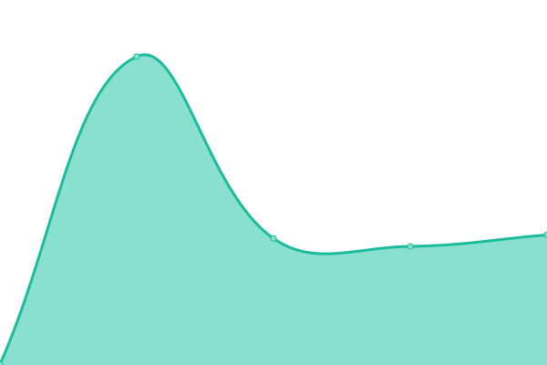 291ms
     
 | 

<a href="https://upptime.outercore.ai/history/pastelock-drand-love">0.00%</a>
    

|  [peerpad.net](https://peerpad.net) | 🟩 Up | [peerpad-net.yml](https://github.com/protocol/upptime-pln/commits/HEAD/history/peerpad-net.yml) | 

 481ms
     
 | 

<a href="https://upptime.outercore.ai/history/peerpad-net">100.00%</a>
    

|  [pl-launchpad.io](https://pl-launchpad.io) | 🟩 Up | [pl-launchpad-io.yml](https://github.com/protocol/upptime-pln/commits/HEAD/history/pl-launchpad-io.yml) | 

 493ms
     
 | 

<a href="https://upptime.outercore.ai/history/pl-launchpad-io">100.00%</a>
    

|  [project-repos.ipfs.io](https://project-repos.ipfs.io) | 🟩 Up | [project-repos-ipfs-io.yml](https://github.com/protocol/upptime-pln/commits/HEAD/history/project-repos-ipfs-io.yml) | 

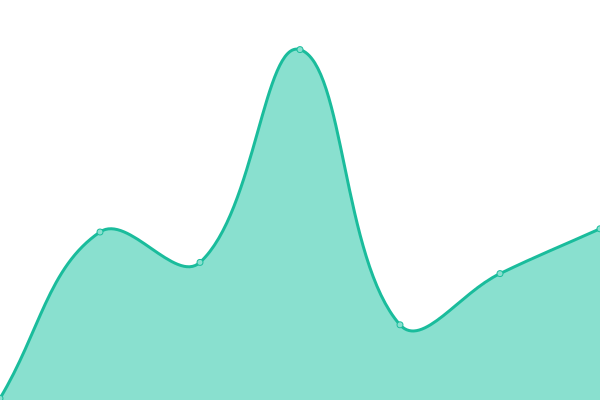 409ms
     
 | 

<a href="https://upptime.outercore.ai/history/project-repos-ipfs-io">100.00%</a>
    

|  [proofs.filecoin.io](https://proofs.filecoin.io) | 🟩 Up | [proofs-filecoin-io.yml](https://github.com/protocol/upptime-pln/commits/HEAD/history/proofs-filecoin-io.yml) | 

 896ms
     
 | 

<a href="https://upptime.outercore.ai/history/proofs-filecoin-io">100.00%</a>
    

|  [proto.school](https://proto.school) | 🟩 Up | [proto-school.yml](https://github.com/protocol/upptime-pln/commits/HEAD/history/proto-school.yml) | 

 796ms
     
 | 

<a href="https://upptime.outercore.ai/history/proto-school">100.00%</a>
    

|  [protocol.ai](https://protocol.ai) | 🟥 Down | [protocol-ai.yml](https://github.com/protocol/upptime-pln/commits/HEAD/history/protocol-ai.yml) | 

 211ms
     
 | 

<a href="https://upptime.outercore.ai/history/protocol-ai">0.00%</a>
    

|  [recursive.ipfs.io](https://recursive.ipfs.io) | 🟩 Up | [recursive-ipfs-io.yml](https://github.com/protocol/upptime-pln/commits/HEAD/history/recursive-ipfs-io.yml) | 

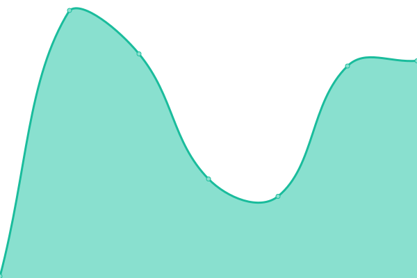 808ms
     
 | 

<a href="https://upptime.outercore.ai/history/recursive-ipfs-io">100.00%</a>
    

|  [refs.ipfs.io](https://refs.ipfs.io) | 🟩 Up | [refs-ipfs-io.yml](https://github.com/protocol/upptime-pln/commits/HEAD/history/refs-ipfs-io.yml) | 

 901ms
     
 | 

<a href="https://upptime.outercore.ai/history/refs-ipfs-io">100.00%</a>
    

|  [research.protocol.ai](https://research.protocol.ai) | 🟩 Up | [research-protocol-ai.yml](https://github.com/protocol/upptime-pln/commits/HEAD/history/research-protocol-ai.yml) | 

 1121ms
     
 | 

<a href="https://upptime.outercore.ai/history/research-protocol-ai">96.18%</a>
    

|  [researchroadmaps.ai](https://researchroadmaps.ai) | 🟥 Down | [researchroadmaps-ai.yml](https://github.com/protocol/upptime-pln/commits/HEAD/history/researchroadmaps-ai.yml) | 

 0ms
     
 | 

<a href="https://upptime.outercore.ai/history/researchroadmaps-ai">0.00%</a>
    

|  [retrieval.market](https://retrieval.market) | 🟩 Up | [retrieval-market.yml](https://github.com/protocol/upptime-pln/commits/HEAD/history/retrieval-market.yml) | 

 465ms
     
 | 

<a href="https://upptime.outercore.ai/history/retrieval-market">100.00%</a>
    

|  [rfs.fvm.dev](https://rfs.fvm.dev) | 🟩 Up | [rfs-fvm-dev.yml](https://github.com/protocol/upptime-pln/commits/HEAD/history/rfs-fvm-dev.yml) | 

 408ms
     
 | 

<a href="https://upptime.outercore.ai/history/rfs-fvm-dev">100.00%</a>
    

|  [ru.dev.wikipedia-on-ipfs.org](https://ru.dev.wikipedia-on-ipfs.org) | 🟩 Up | [ru-dev-wikipedia-on-ipfs-org.yml](https://github.com/protocol/upptime-pln/commits/HEAD/history/ru-dev-wikipedia-on-ipfs-org.yml) | 

 747ms
     
 | 

<a href="https://upptime.outercore.ai/history/ru-dev-wikipedia-on-ipfs-org">100.00%</a>
    

|  [ru.wikipedia-on-ipfs.org](https://ru.wikipedia-on-ipfs.org) | 🟩 Up | [ru-wikipedia-on-ipfs-org.yml](https://github.com/protocol/upptime-pln/commits/HEAD/history/ru-wikipedia-on-ipfs-org.yml) | 

 458ms
     
 | 

<a href="https://upptime.outercore.ai/history/ru-wikipedia-on-ipfs-org">100.00%</a>
    

|  [saft-project.com](https://saft-project.com) | 🟩 Up | [saft-project-com.yml](https://github.com/protocol/upptime-pln/commits/HEAD/history/saft-project-com.yml) | 

 558ms
     
 | 

<a href="https://upptime.outercore.ai/history/saft-project-com">100.00%</a>
    

|  [saft-project.org](https://saft-project.org) | 🟩 Up | [saft-project-org.yml](https://github.com/protocol/upptime-pln/commits/HEAD/history/saft-project-org.yml) | 

 668ms
     
 | 

<a href="https://upptime.outercore.ai/history/saft-project-org">100.00%</a>
    

|  [saftproject.com](https://saftproject.com) | 🟩 Up | [saftproject-com.yml](https://github.com/protocol/upptime-pln/commits/HEAD/history/saftproject-com.yml) | 

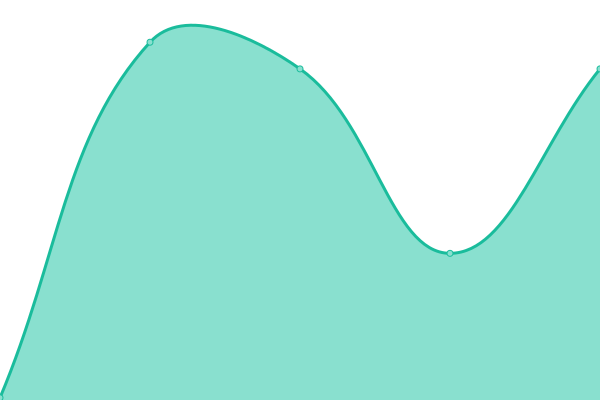 592ms
     
 | 

<a href="https://upptime.outercore.ai/history/saftproject-com">100.00%</a>
    

|  [saturn.tech](https://saturn.tech) | 🟩 Up | [saturn-tech.yml](https://github.com/protocol/upptime-pln/commits/HEAD/history/saturn-tech.yml) | 

 287ms
     
 | 

<a href="https://upptime.outercore.ai/history/saturn-tech">100.00%</a>
    

|  [sbs.earth](https://sbs.earth) | 🟩 Up | [sbs-earth.yml](https://github.com/protocol/upptime-pln/commits/HEAD/history/sbs-earth.yml) | 

 534ms
     
 | 

<a href="https://upptime.outercore.ai/history/sbs-earth">100.00%</a>
    

|  [sbs.tech](https://sbs.tech) | 🟩 Up | [sbs-tech.yml](https://github.com/protocol/upptime-pln/commits/HEAD/history/sbs-tech.yml) | 

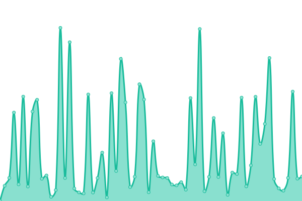 461ms
     
 | 

<a href="https://upptime.outercore.ai/history/sbs-tech">100.00%</a>
    

|  [security.filecoin.io](https://security.filecoin.io) | 🟩 Up | [security-filecoin-io.yml](https://github.com/protocol/upptime-pln/commits/HEAD/history/security-filecoin-io.yml) | 

 395ms
     
 | 

<a href="https://upptime.outercore.ai/history/security-filecoin-io">100.00%</a>
    

|  [share.ipfs.io](https://share.ipfs.io) | 🟩 Up | [share-ipfs-io.yml](https://github.com/protocol/upptime-pln/commits/HEAD/history/share-ipfs-io.yml) | 

 329ms
     
 | 

<a href="https://upptime.outercore.ai/history/share-ipfs-io">100.00%</a>
    

|  [shop.filecoin.io](https://shop.filecoin.io) | 🟩 Up | [shop-filecoin-io.yml](https://github.com/protocol/upptime-pln/commits/HEAD/history/shop-filecoin-io.yml) | 

 168ms
     
 | 

<a href="https://upptime.outercore.ai/history/shop-filecoin-io">99.94%</a>
    

|  [shop.ipfs.io](https://shop.ipfs.io) | 🟩 Up | [shop-ipfs-io.yml](https://github.com/protocol/upptime-pln/commits/HEAD/history/shop-ipfs-io.yml) | 

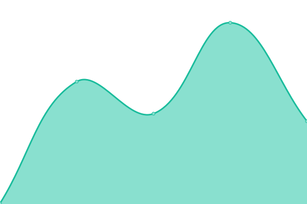 150ms
     
 | 

<a href="https://upptime.outercore.ai/history/shop-ipfs-io">100.00%</a>
    

|  [shop.protocol.ai](https://shop.protocol.ai) | 🟩 Up | [shop-protocol-ai.yml](https://github.com/protocol/upptime-pln/commits/HEAD/history/shop-protocol-ai.yml) | 

 254ms
     
 | 

<a href="https://upptime.outercore.ai/history/shop-protocol-ai">100.00%</a>
    

|  [singularity.storage](https://singularity.storage) | 🟥 Down | [singularity-storage.yml](https://github.com/protocol/upptime-pln/commits/HEAD/history/singularity-storage.yml) | 

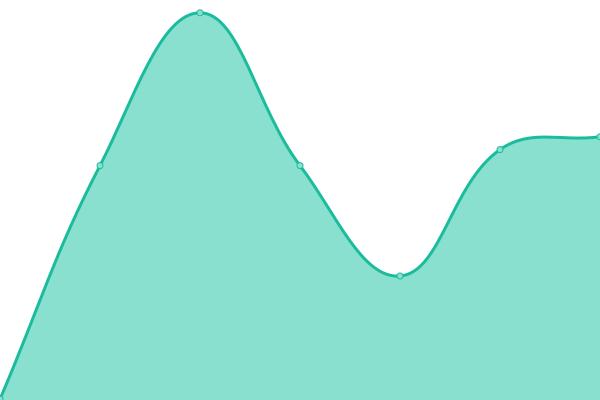 597ms
     
 | 

<a href="https://upptime.outercore.ai/history/singularity-storage">72.55%</a>
    

|  [slingshot.filecoin.io](https://slingshot.filecoin.io) | 🟩 Up | [slingshot-filecoin-io.yml](https://github.com/protocol/upptime-pln/commits/HEAD/history/slingshot-filecoin-io.yml) | 

 333ms
     
 | 

<a href="https://upptime.outercore.ai/history/slingshot-filecoin-io">100.00%</a>
    

|  [spacerace.filecoin.io](https://spacerace.filecoin.io) | 🟩 Up | [spacerace-filecoin-io.yml](https://github.com/protocol/upptime-pln/commits/HEAD/history/spacerace-filecoin-io.yml) | 

 248ms
     
 | 

<a href="https://upptime.outercore.ai/history/spacerace-filecoin-io">100.00%</a>
    

|  [spacewarp.fvm.dev](https://spacewarp.fvm.dev) | 🟩 Up | [spacewarp-fvm-dev.yml](https://github.com/protocol/upptime-pln/commits/HEAD/history/spacewarp-fvm-dev.yml) | 

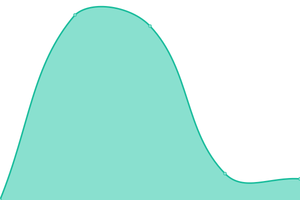 1099ms
     
 | 

<a href="https://upptime.outercore.ai/history/spacewarp-fvm-dev">100.00%</a>
    

|  [spec.filecoin.io](https://spec.filecoin.io) | 🟩 Up | [spec-filecoin-io.yml](https://github.com/protocol/upptime-pln/commits/HEAD/history/spec-filecoin-io.yml) | 

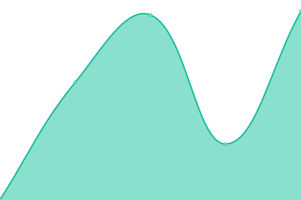 465ms
     
 | 

<a href="https://upptime.outercore.ai/history/spec-filecoin-io">100.00%</a>
    

|  [specs.ipfs.tech](https://specs.ipfs.tech) | 🟩 Up | [specs-ipfs-tech.yml](https://github.com/protocol/upptime-pln/commits/HEAD/history/specs-ipfs-tech.yml) | 

 375ms
     
 | 

<a href="https://upptime.outercore.ai/history/specs-ipfs-tech">100.00%</a>
    

|  [specs.ipld.io](https://specs.ipld.io) | 🟩 Up | [specs-ipld-io.yml](https://github.com/protocol/upptime-pln/commits/HEAD/history/specs-ipld-io.yml) | 

 240ms
     
 | 

<a href="https://upptime.outercore.ai/history/specs-ipld-io">100.00%</a>
    

|  [stable.slingshot.filecoin.io](https://stable.slingshot.filecoin.io) | 🟥 Down | [stable-slingshot-filecoin-io.yml](https://github.com/protocol/upptime-pln/commits/HEAD/history/stable-slingshot-filecoin-io.yml) | 

 0ms
     
 | 

<a href="https://upptime.outercore.ai/history/stable-slingshot-filecoin-io">0.00%</a>
    

|  [staging.impactevaluator.io](https://staging.impactevaluator.io) | 🟩 Up | [staging-impactevaluator-io.yml](https://github.com/protocol/upptime-pln/commits/HEAD/history/staging-impactevaluator-io.yml) | 

 197ms
     
 | 

<a href="https://upptime.outercore.ai/history/staging-impactevaluator-io">100.00%</a>
    

|  [staging.plnetwork.io](https://staging.plnetwork.io) | 🟩 Up | [staging-plnetwork-io.yml](https://github.com/protocol/upptime-pln/commits/HEAD/history/staging-plnetwork-io.yml) | 

 217ms
     
 | 

<a href="https://upptime.outercore.ai/history/staging-plnetwork-io">100.00%</a>
    

|  [starmap.site](https://starmap.site) | 🟩 Up | [starmap-site.yml](https://github.com/protocol/upptime-pln/commits/HEAD/history/starmap-site.yml) | 

 2854ms
     
 | 

<a href="https://upptime.outercore.ai/history/starmap-site">100.00%</a>
    

|  [stats.singularity.storage](https://stats.singularity.storage) | 🟩 Up | [stats-singularity-storage.yml](https://github.com/protocol/upptime-pln/commits/HEAD/history/stats-singularity-storage.yml) | 

 322ms
     
 | 

<a href="https://upptime.outercore.ai/history/stats-singularity-storage">100.00%</a>
    

|  [status.drand.love](https://status.drand.love) | 🟩 Up | [status-drand-love.yml](https://github.com/protocol/upptime-pln/commits/HEAD/history/status-drand-love.yml) | 

 938ms
     
 | 

<a href="https://upptime.outercore.ai/history/status-drand-love">100.00%</a>
    

|  [status.filecoin.io](https://status.filecoin.io) | 🟩 Up | [status-filecoin-io.yml](https://github.com/protocol/upptime-pln/commits/HEAD/history/status-filecoin-io.yml) | 

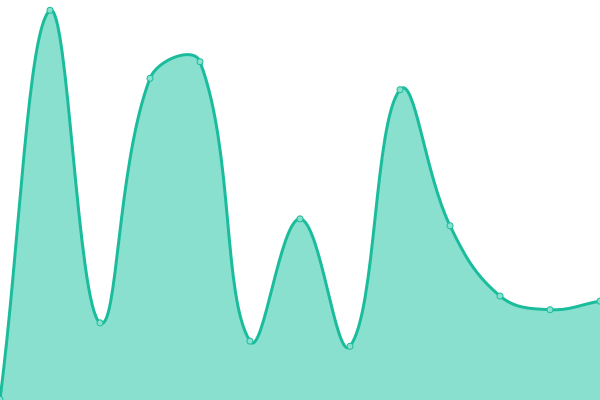 518ms
     
 | 

<a href="https://upptime.outercore.ai/history/status-filecoin-io">100.00%</a>
    

|  [storage.filecoin.io](https://storage.filecoin.io) | 🟩 Up | [storage-filecoin-io.yml](https://github.com/protocol/upptime-pln/commits/HEAD/history/storage-filecoin-io.yml) | 

 512ms
     
 | 

<a href="https://upptime.outercore.ai/history/storage-filecoin-io">100.00%</a>
    

|  [storage.market](https://storage.market) | 🟥 Down | [storage-market.yml](https://github.com/protocol/upptime-pln/commits/HEAD/history/storage-market.yml) | 

 625ms
     
 | 

<a href="https://upptime.outercore.ai/history/storage-market">0.00%</a>
    

|  [timeline.fvm.dev](https://timeline.fvm.dev) | 🟩 Up | [timeline-fvm-dev.yml](https://github.com/protocol/upptime-pln/commits/HEAD/history/timeline-fvm-dev.yml) | 

 208ms
     
 | 

<a href="https://upptime.outercore.ai/history/timeline-fvm-dev">100.00%</a>
    

|  [timevault.drand.love](https://timevault.drand.love) | 🟩 Up | [timevault-drand-love.yml](https://github.com/protocol/upptime-pln/commits/HEAD/history/timevault-drand-love.yml) | 

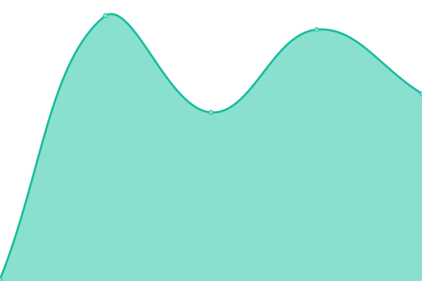 171ms
     
 | 

<a href="https://upptime.outercore.ai/history/timevault-drand-love">100.00%</a>
    

|  [tr.dev.wikipedia-on-ipfs.org](https://tr.dev.wikipedia-on-ipfs.org) | 🟩 Up | [tr-dev-wikipedia-on-ipfs-org.yml](https://github.com/protocol/upptime-pln/commits/HEAD/history/tr-dev-wikipedia-on-ipfs-org.yml) | 

 555ms
     
 | 

<a href="https://upptime.outercore.ai/history/tr-dev-wikipedia-on-ipfs-org">100.00%</a>
    

|  [tr.wikipedia-on-ipfs.org](https://tr.wikipedia-on-ipfs.org) | 🟩 Up | [tr-wikipedia-on-ipfs-org.yml](https://github.com/protocol/upptime-pln/commits/HEAD/history/tr-wikipedia-on-ipfs-org.yml) | 

 435ms
     
 | 

<a href="https://upptime.outercore.ai/history/tr-wikipedia-on-ipfs-org">100.00%</a>
    

|  [trusted-setup-snapdeals.filecoin.io](https://trusted-setup-snapdeals.filecoin.io) | 🟩 Up | [trusted-setup-snapdeals-filecoin-io.yml](https://github.com/protocol/upptime-pln/commits/HEAD/history/trusted-setup-snapdeals-filecoin-io.yml) | 

 896ms
     
 | 

<a href="https://upptime.outercore.ai/history/trusted-setup-snapdeals-filecoin-io">100.00%</a>
    

|  [trusted-setup.filecoin.io](https://trusted-setup.filecoin.io) | 🟩 Up | [trusted-setup-filecoin-io.yml](https://github.com/protocol/upptime-pln/commits/HEAD/history/trusted-setup-filecoin-io.yml) | 

 911ms
     
 | 

<a href="https://upptime.outercore.ai/history/trusted-setup-filecoin-io">100.00%</a>
    

|  [uk.wikipedia-on-ipfs.org](https://uk.wikipedia-on-ipfs.org) | 🟩 Up | [uk-wikipedia-on-ipfs-org.yml](https://github.com/protocol/upptime-pln/commits/HEAD/history/uk-wikipedia-on-ipfs-org.yml) | 

 416ms
     
 | 

<a href="https://upptime.outercore.ai/history/uk-wikipedia-on-ipfs-org">100.00%</a>
    

|  [v2.slingshot.filecoin.io](https://v2.slingshot.filecoin.io) | 🟥 Down | [v2-slingshot-filecoin-io.yml](https://github.com/protocol/upptime-pln/commits/HEAD/history/v2-slingshot-filecoin-io.yml) | 

 0ms
     
 | 

<a href="https://upptime.outercore.ai/history/v2-slingshot-filecoin-io">0.00%</a>
    

|  [venus.filecoin.io](https://venus.filecoin.io) | 🟩 Up | [venus-filecoin-io.yml](https://github.com/protocol/upptime-pln/commits/HEAD/history/venus-filecoin-io.yml) | 

 124ms
     
 | 

<a href="https://upptime.outercore.ai/history/venus-filecoin-io">100.00%</a>
    

|  [web3.storage](https://web3.storage) | 🟩 Up | [web3-storage.yml](https://github.com/protocol/upptime-pln/commits/HEAD/history/web3-storage.yml) | 

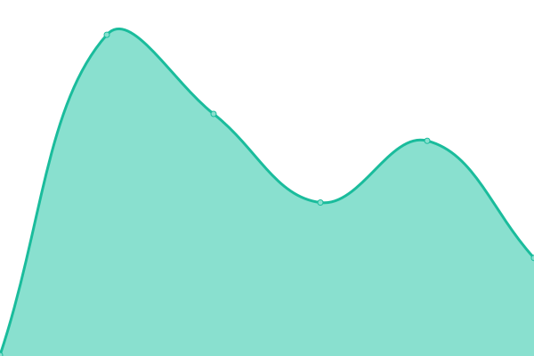 176ms
     
 | 

<a href="https://upptime.outercore.ai/history/web3-storage">100.00%</a>
    

|  [website.ipfs.io](https://website.ipfs.io) | 🟩 Up | [website-ipfs-io.yml](https://github.com/protocol/upptime-pln/commits/HEAD/history/website-ipfs-io.yml) | 

 239ms
     
 | 

<a href="https://upptime.outercore.ai/history/website-ipfs-io">0.00%</a>
    

|  [webui.ipfs.io](https://webui.ipfs.io) | 🟩 Up | [webui-ipfs-io.yml](https://github.com/protocol/upptime-pln/commits/HEAD/history/webui-ipfs-io.yml) | 

 408ms
     
 | 

<a href="https://upptime.outercore.ai/history/webui-ipfs-io">100.00%</a>
    

|  [week1.filecoin-goldenretriever.io](https://week1.filecoin-goldenretriever.io) | 🟥 Down | [week1-filecoin-goldenretriever-io.yml](https://github.com/protocol/upptime-pln/commits/HEAD/history/week1-filecoin-goldenretriever-io.yml) | 

 0ms
     
 | 

<a href="https://upptime.outercore.ai/history/week1-filecoin-goldenretriever-io">0.00%</a>
    

|  [week2.filecoin-goldenretriever.io](https://week2.filecoin-goldenretriever.io) | 🟥 Down | [week2-filecoin-goldenretriever-io.yml](https://github.com/protocol/upptime-pln/commits/HEAD/history/week2-filecoin-goldenretriever-io.yml) | 

 0ms
     
 | 

<a href="https://upptime.outercore.ai/history/week2-filecoin-goldenretriever-io">0.00%</a>
    

|  [week3.filecoin-goldenretriever.io](https://week3.filecoin-goldenretriever.io) | 🟥 Down | [week3-filecoin-goldenretriever-io.yml](https://github.com/protocol/upptime-pln/commits/HEAD/history/week3-filecoin-goldenretriever-io.yml) | 

 0ms
     
 | 

<a href="https://upptime.outercore.ai/history/week3-filecoin-goldenretriever-io">0.00%</a>
    

|  [week4.filecoin-goldenretriever.io](https://week4.filecoin-goldenretriever.io) | 🟥 Down | [week4-filecoin-goldenretriever-io.yml](https://github.com/protocol/upptime-pln/commits/HEAD/history/week4-filecoin-goldenretriever-io.yml) | 

 0ms
     
 | 

<a href="https://upptime.outercore.ai/history/week4-filecoin-goldenretriever-io">0.00%</a>
    

|  [week5.filecoin-goldenretriever.io](https://week5.filecoin-goldenretriever.io) | 🟥 Down | [week5-filecoin-goldenretriever-io.yml](https://github.com/protocol/upptime-pln/commits/HEAD/history/week5-filecoin-goldenretriever-io.yml) | 

 0ms
     
 | 

<a href="https://upptime.outercore.ai/history/week5-filecoin-goldenretriever-io">0.00%</a>
    

|  [week6.filecoin-goldenretriever.io](https://week6.filecoin-goldenretriever.io) | 🟥 Down | [week6-filecoin-goldenretriever-io.yml](https://github.com/protocol/upptime-pln/commits/HEAD/history/week6-filecoin-goldenretriever-io.yml) | 

 0ms
     
 | 

<a href="https://upptime.outercore.ai/history/week6-filecoin-goldenretriever-io">0.00%</a>
    

|  [week7.filecoin-goldenretriever.io](https://week7.filecoin-goldenretriever.io) | 🟥 Down | [week7-filecoin-goldenretriever-io.yml](https://github.com/protocol/upptime-pln/commits/HEAD/history/week7-filecoin-goldenretriever-io.yml) | 

 0ms
     
 | 

<a href="https://upptime.outercore.ai/history/week7-filecoin-goldenretriever-io">0.00%</a>
    

|  [week8.filecoin-goldenretriever.io](https://week8.filecoin-goldenretriever.io) | 🟥 Down | [week8-filecoin-goldenretriever-io.yml](https://github.com/protocol/upptime-pln/commits/HEAD/history/week8-filecoin-goldenretriever-io.yml) | 

 0ms
     
 | 

<a href="https://upptime.outercore.ai/history/week8-filecoin-goldenretriever-io">0.00%</a>
    

|  [workshop.cluster.ipfs.io](https://workshop.cluster.ipfs.io) | 🟩 Up | [workshop-cluster-ipfs-io.yml](https://github.com/protocol/upptime-pln/commits/HEAD/history/workshop-cluster-ipfs-io.yml) | 

 420ms
     
 | 

<a href="https://upptime.outercore.ai/history/workshop-cluster-ipfs-io">100.00%</a>
    

|  [wrtc-star1.par.dwebops.pub](https://wrtc-star1.par.dwebops.pub) | 🟥 Down | [wrtc-star1-par-dwebops-pub.yml](https://github.com/protocol/upptime-pln/commits/HEAD/history/wrtc-star1-par-dwebops-pub.yml) | 

 0ms
     
 | 

<a href="https://upptime.outercore.ai/history/wrtc-star1-par-dwebops-pub">100.00%</a>
    

|  [wrtc-star2.sjc.dwebops.pub](https://wrtc-star2.sjc.dwebops.pub) | 🟥 Down | [wrtc-star2-sjc-dwebops-pub.yml](https://github.com/protocol/upptime-pln/commits/HEAD/history/wrtc-star2-sjc-dwebops-pub.yml) | 

 0ms
     
 | 

<a href="https://upptime.outercore.ai/history/wrtc-star2-sjc-dwebops-pub">100.00%</a>
    

|  [www.filecoin-goldenretriever.io](https://www.filecoin-goldenretriever.io) | 🟩 Up | [www-filecoin-goldenretriever-io.yml](https://github.com/protocol/upptime-pln/commits/HEAD/history/www-filecoin-goldenretriever-io.yml) | 

 435ms
     
 | 

<a href="https://upptime.outercore.ai/history/www-filecoin-goldenretriever-io">100.00%</a>
    

|  [www.filstation.app](https://www.filstation.app) | 🟩 Up | [www-filstation-app.yml](https://github.com/protocol/upptime-pln/commits/HEAD/history/www-filstation-app.yml) | 

 361ms
     
 | 

<a href="https://upptime.outercore.ai/history/www-filstation-app">100.00%</a>
    

|  [www.ipc.space](https://www.ipc.space) | 🟩 Up | [www-ipc-space.yml](https://github.com/protocol/upptime-pln/commits/HEAD/history/www-ipc-space.yml) | 

 255ms
     
 | 

<a href="https://upptime.outercore.ai/history/www-ipc-space">100.00%</a>
    

|  [www.ipfs.io](https://www.ipfs.io) | 🟩 Up | [www-ipfs-io.yml](https://github.com/protocol/upptime-pln/commits/HEAD/history/www-ipfs-io.yml) | 

 229ms
     
 | 

<a href="https://upptime.outercore.ai/history/www-ipfs-io">0.00%</a>
    

|  [www.plnetwork.io](https://www.plnetwork.io) | 🟩 Up | [www-plnetwork-io.yml](https://github.com/protocol/upptime-pln/commits/HEAD/history/www-plnetwork-io.yml) | 

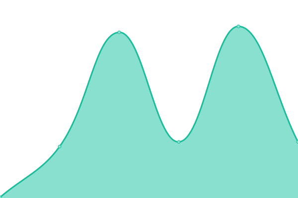 103ms
     
 | 

<a href="https://upptime.outercore.ai/history/www-plnetwork-io">100.00%</a>
    

|  [zh.dev.wikipedia-on-ipfs.org](https://zh.dev.wikipedia-on-ipfs.org) | 🟩 Up | [zh-dev-wikipedia-on-ipfs-org.yml](https://github.com/protocol/upptime-pln/commits/HEAD/history/zh-dev-wikipedia-on-ipfs-org.yml) | 

 509ms
     
 | 

<a href="https://upptime.outercore.ai/history/zh-dev-wikipedia-on-ipfs-org">100.00%</a>
    

|  [zh.wikipedia-on-ipfs.org](https://zh.wikipedia-on-ipfs.org) | 🟩 Up | [zh-wikipedia-on-ipfs-org.yml](https://github.com/protocol/upptime-pln/commits/HEAD/history/zh-wikipedia-on-ipfs-org.yml) | 

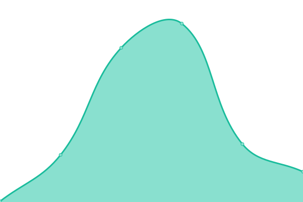 440ms
     
 | 

<a href="https://upptime.outercore.ai/history/zh-wikipedia-on-ipfs-org">100.00%</a>
    

<!--end: status pages-->

[**Visit our status website →**](https://upptime.outercore.ai)

## 📄 License

- Powered by: [Upptime](https://github.com/upptime/upptime)
- Code: [MIT](./LICENSE) © [chase.fil](https://upptime.outercore.ai)
- Data in the `./history` directory: [Open Database License](https://opendatacommons.org/licenses/odbl/1-0/)
