# [📈 Live Status](https://upptime.outercore.ai): <!--live status--> **🟩 All systems operational**

This repository contains the open-source uptime monitor and status page for [chase.fil](https://upptime.outercore.ai), powered by [Upptime](https://github.com/upptime/upptime).

With [Upptime](https://upptime.js.org), you can get your own unlimited and free uptime monitor and status page, powered entirely by a GitHub repository. We use [Issues](https://github.com/vesahc/upptime-pln/issues) as incident reports, [Actions](https://github.com/vesahc/upptime-pln/actions) as uptime monitors, and [Pages](https://upptime.outercore.ai) for the status page.

<!--start: status pages-->
<!-- This summary is generated by Upptime (https://github.com/upptime/upptime) -->
<!-- Do not edit this manually, your changes will be overwritten -->
<!-- prettier-ignore -->
| URL | Status | History | Response Time | Uptime |
| --- | ------ | ------- | ------------- | ------ |
|  [arewedistributedyet.com](https://arewedistributedyet.com) | 🟩 Up | [arewedistributedyet-com.yml](https://github.com/vesahc/upptime-pln/commits/HEAD/history/arewedistributedyet-com.yml) | 

 960ms
     
 | 

<a href="https://upptime.outercore.ai/history/arewedistributedyet-com">100.00%</a>
    

|  [badbits.dwebops.pub](https://badbits.dwebops.pub) | 🟩 Up | [badbits-dwebops-pub.yml](https://github.com/vesahc/upptime-pln/commits/HEAD/history/badbits-dwebops-pub.yml) | 

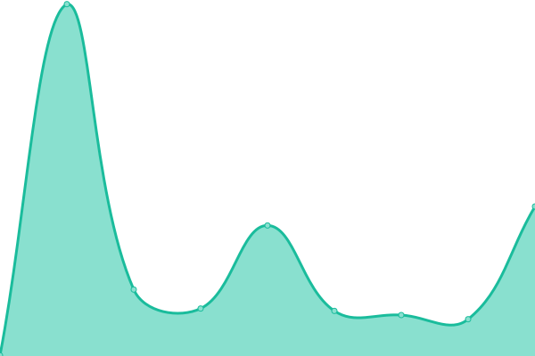 234ms
     
 | 

<a href="https://upptime.outercore.ai/history/badbits-dwebops-pub">100.00%</a>
    

|  [benchmark-js.ipfs.io](https://benchmark-js.ipfs.io) | 🟩 Up | [benchmark-js-ipfs-io.yml](https://github.com/vesahc/upptime-pln/commits/HEAD/history/benchmark-js-ipfs-io.yml) | 

 237ms
     
 | 

<a href="https://upptime.outercore.ai/history/benchmark-js-ipfs-io">100.00%</a>
    

|  [bifrost-gateway.ipfs.io](https://bifrost-gateway.ipfs.io) | 🟩 Up | [bifrost-gateway-ipfs-io.yml](https://github.com/vesahc/upptime-pln/commits/HEAD/history/bifrost-gateway-ipfs-io.yml) | 

 114ms
     
 | 

<a href="https://upptime.outercore.ai/history/bifrost-gateway-ipfs-io">100.00%</a>
    

|  [bifrost-gateway.stage.ipfs.io](https://bifrost-gateway.stage.ipfs.io) | 🟩 Up | [bifrost-gateway-stage-ipfs-io.yml](https://github.com/vesahc/upptime-pln/commits/HEAD/history/bifrost-gateway-stage-ipfs-io.yml) | 

 213ms
     
 | 

<a href="https://upptime.outercore.ai/history/bifrost-gateway-stage-ipfs-io">69.64%</a>
    

|  [blocks.ipfs.io](https://blocks.ipfs.io) | 🟩 Up | [blocks-ipfs-io.yml](https://github.com/vesahc/upptime-pln/commits/HEAD/history/blocks-ipfs-io.yml) | 

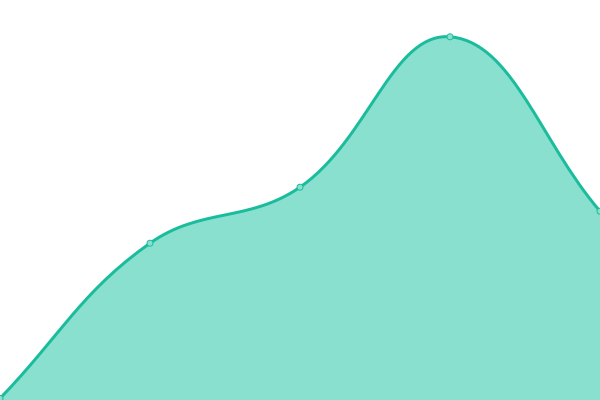 184ms
     
 | 

<a href="https://upptime.outercore.ai/history/blocks-ipfs-io">100.00%</a>
    

|  [buildingweb3.com](https://buildingweb3.com) | 🟩 Up | [buildingweb3-com.yml](https://github.com/vesahc/upptime-pln/commits/HEAD/history/buildingweb3-com.yml) | 

 1027ms
     
 | 

<a href="https://upptime.outercore.ai/history/buildingweb3-com">100.00%</a>
    

|  [chain.love](https://chain.love) | 🟩 Up | [chain-love.yml](https://github.com/vesahc/upptime-pln/commits/HEAD/history/chain-love.yml) | 

 342ms
     
 | 

<a href="https://upptime.outercore.ai/history/chain-love">100.00%</a>
    

|  [consensus-factory.io](https://consensus-factory.io) | 🟩 Up | [consensus-factory-io.yml](https://github.com/vesahc/upptime-pln/commits/HEAD/history/consensus-factory-io.yml) | 

 638ms
     
 | 

<a href="https://upptime.outercore.ai/history/consensus-factory-io">100.00%</a>
    

|  [cryptoeconlab.io](https://cryptoeconlab.io) | 🟩 Up | [cryptoeconlab-io.yml](https://github.com/vesahc/upptime-pln/commits/HEAD/history/cryptoeconlab-io.yml) | 

 582ms
     
 | 

<a href="https://upptime.outercore.ai/history/cryptoeconlab-io">100.00%</a>
    

|  [dag.house](https://dag.house) | 🟩 Up | [dag-house.yml](https://github.com/vesahc/upptime-pln/commits/HEAD/history/dag-house.yml) | 

 345ms
     
 | 

<a href="https://upptime.outercore.ai/history/dag-house">100.00%</a>
    

|  [datacapstats.io](https://datacapstats.io) | 🟩 Up | [datacapstats-io.yml](https://github.com/vesahc/upptime-pln/commits/HEAD/history/datacapstats-io.yml) | 

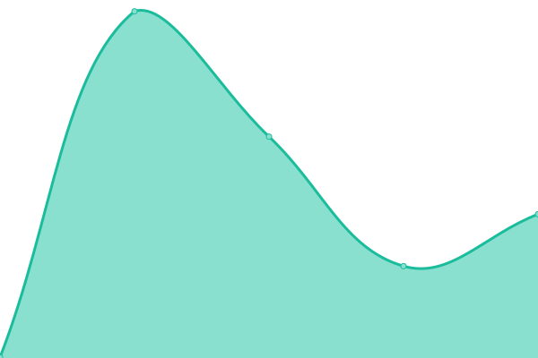 238ms
     
 | 

<a href="https://upptime.outercore.ai/history/datacapstats-io">100.00%</a>
    

|  [dataprograms.org](https://dataprograms.org) | 🟩 Up | [dataprograms-org.yml](https://github.com/vesahc/upptime-pln/commits/HEAD/history/dataprograms-org.yml) | 

 407ms
     
 | 

<a href="https://upptime.outercore.ai/history/dataprograms-org">100.00%</a>
    

|  [datatogether.org](https://datatogether.org) | 🟩 Up | [datatogether-org.yml](https://github.com/vesahc/upptime-pln/commits/HEAD/history/datatogether-org.yml) | 

 230ms
     
 | 

<a href="https://upptime.outercore.ai/history/datatogether-org">100.00%</a>
    

|  [dev.webui.ipfs.io](https://dev.webui.ipfs.io) | 🟩 Up | [dev-webui-ipfs-io.yml](https://github.com/vesahc/upptime-pln/commits/HEAD/history/dev-webui-ipfs-io.yml) | 

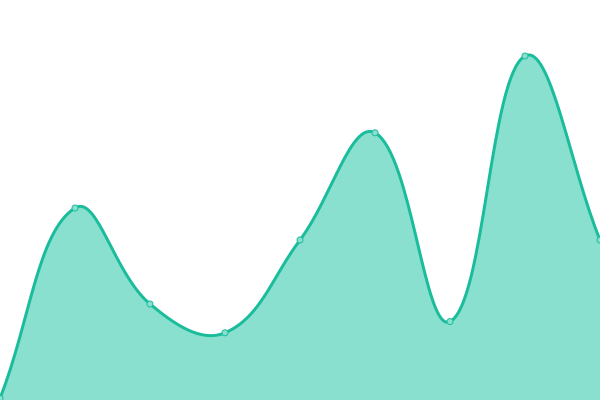 131ms
     
 | 

<a href="https://upptime.outercore.ai/history/dev-webui-ipfs-io">100.00%</a>
    

|  [discoursegraphs.ai](https://discoursegraphs.ai) | 🟩 Up | [discoursegraphs-ai.yml](https://github.com/vesahc/upptime-pln/commits/HEAD/history/discoursegraphs-ai.yml) | 

 292ms
     
 | 

<a href="https://upptime.outercore.ai/history/discoursegraphs-ai">100.00%</a>
    

|  [discuss.ipfs.tech](https://discuss.ipfs.tech) | 🟩 Up | [discuss-ipfs-tech.yml](https://github.com/vesahc/upptime-pln/commits/HEAD/history/discuss-ipfs-tech.yml) | 

 365ms
     
 | 

<a href="https://upptime.outercore.ai/history/discuss-ipfs-tech">100.00%</a>
    

|  [dist.ipfs.io](https://dist.ipfs.io) | 🟩 Up | [dist-ipfs-io.yml](https://github.com/vesahc/upptime-pln/commits/HEAD/history/dist-ipfs-io.yml) | 

 160ms
     
 | 

<a href="https://upptime.outercore.ai/history/dist-ipfs-io">100.00%</a>
    

|  [dist.ipfs.tech](https://dist.ipfs.tech) | 🟩 Up | [dist-ipfs-tech.yml](https://github.com/vesahc/upptime-pln/commits/HEAD/history/dist-ipfs-tech.yml) | 

 167ms
     
 | 

<a href="https://upptime.outercore.ai/history/dist-ipfs-tech">100.00%</a>
    

|  [dnslink.dev](https://dnslink.dev) | 🟩 Up | [dnslink-dev.yml](https://github.com/vesahc/upptime-pln/commits/HEAD/history/dnslink-dev.yml) | 

 749ms
     
 | 

<a href="https://upptime.outercore.ai/history/dnslink-dev">100.00%</a>
    

|  [dnslink.io](https://dnslink.io) | 🟩 Up | [dnslink-io.yml](https://github.com/vesahc/upptime-pln/commits/HEAD/history/dnslink-io.yml) | 

 511ms
     
 | 

<a href="https://upptime.outercore.ai/history/dnslink-io">100.00%</a>
    

|  [dnslink.org](https://dnslink.org) | 🟩 Up | [dnslink-org.yml](https://github.com/vesahc/upptime-pln/commits/HEAD/history/dnslink-org.yml) | 

 519ms
     
 | 

<a href="https://upptime.outercore.ai/history/dnslink-org">100.00%</a>
    

|  [drand.love](https://drand.love) | 🟩 Up | [drand-love.yml](https://github.com/vesahc/upptime-pln/commits/HEAD/history/drand-love.yml) | 

 559ms
     
 | 

<a href="https://upptime.outercore.ai/history/drand-love">100.00%</a>
    

|  [fil-safts.com](https://fil-safts.com) | 🟩 Up | [fil-safts-com.yml](https://github.com/vesahc/upptime-pln/commits/HEAD/history/fil-safts-com.yml) | 

 148ms
     
 | 

<a href="https://upptime.outercore.ai/history/fil-safts-com">100.00%</a>
    

|  [fil.space](https://fil.space) | 🟩 Up | [fil-space.yml](https://github.com/vesahc/upptime-pln/commits/HEAD/history/fil-space.yml) | 

 513ms
     
 | 

<a href="https://upptime.outercore.ai/history/fil-space">100.00%</a>
    

|  [filecoin-explorer.com](https://filecoin-explorer.com) | 🟩 Up | [filecoin-explorer-com.yml](https://github.com/vesahc/upptime-pln/commits/HEAD/history/filecoin-explorer-com.yml) | 

 145ms
     
 | 

<a href="https://upptime.outercore.ai/history/filecoin-explorer-com">100.00%</a>
    

|  [filecoin-tracker.com](https://filecoin-tracker.com) | 🟩 Up | [filecoin-tracker-com.yml](https://github.com/vesahc/upptime-pln/commits/HEAD/history/filecoin-tracker-com.yml) | 

 234ms
     
 | 

<a href="https://upptime.outercore.ai/history/filecoin-tracker-com">100.00%</a>
    

|  [filecoin.io](https://filecoin.io) | 🟩 Up | [filecoin-io.yml](https://github.com/vesahc/upptime-pln/commits/HEAD/history/filecoin-io.yml) | 

 257ms
     
 | 

<a href="https://upptime.outercore.ai/history/filecoin-io">100.00%</a>
    

|  [filecointldr.io](https://filecointldr.io) | 🟩 Up | [filecointldr-io.yml](https://github.com/vesahc/upptime-pln/commits/HEAD/history/filecointldr-io.yml) | 

 489ms
     
 | 

<a href="https://upptime.outercore.ai/history/filecointldr-io">100.00%</a>
    

|  [filecoinunleashed.io](https://filecoinunleashed.io) | 🟩 Up | [filecoinunleashed-io.yml](https://github.com/vesahc/upptime-pln/commits/HEAD/history/filecoinunleashed-io.yml) | 

 1524ms
     
 | 

<a href="https://upptime.outercore.ai/history/filecoinunleashed-io">100.00%</a>
    

|  [filplus.storage](https://filplus.storage) | 🟩 Up | [filplus-storage.yml](https://github.com/vesahc/upptime-pln/commits/HEAD/history/filplus-storage.yml) | 

 524ms
     
 | 

<a href="https://upptime.outercore.ai/history/filplus-storage">100.00%</a>
    

|  [filpoll.io](https://filpoll.io) | 🟩 Up | [filpoll-io.yml](https://github.com/vesahc/upptime-pln/commits/HEAD/history/filpoll-io.yml) | 

 147ms
     
 | 

<a href="https://upptime.outercore.ai/history/filpoll-io">100.00%</a>
    

|  [flipchart.peerpad.net](https://flipchart.peerpad.net) | 🟩 Up | [flipchart-peerpad-net.yml](https://github.com/vesahc/upptime-pln/commits/HEAD/history/flipchart-peerpad-net.yml) | 

 157ms
     
 | 

<a href="https://upptime.outercore.ai/history/flipchart-peerpad-net">100.00%</a>
    

|  [fundingthecommons.io](https://fundingthecommons.io) | 🟩 Up | [fundingthecommons-io.yml](https://github.com/vesahc/upptime-pln/commits/HEAD/history/fundingthecommons-io.yml) | 

 394ms
     
 | 

<a href="https://upptime.outercore.ai/history/fundingthecommons-io">100.00%</a>
    

|  [igis.io](https://igis.io) | 🟩 Up | [igis-io.yml](https://github.com/vesahc/upptime-pln/commits/HEAD/history/igis-io.yml) | 

 168ms
     
 | 

<a href="https://upptime.outercore.ai/history/igis-io">100.00%</a>
    

|  [impactevaluator.io](https://impactevaluator.io) | 🟩 Up | [impactevaluator-io.yml](https://github.com/vesahc/upptime-pln/commits/HEAD/history/impactevaluator-io.yml) | 

 168ms
     
 | 

<a href="https://upptime.outercore.ai/history/impactevaluator-io">100.00%</a>
    

|  [ipc.space](https://ipc.space) | 🟩 Up | [ipc-space.yml](https://github.com/vesahc/upptime-pln/commits/HEAD/history/ipc-space.yml) | 

 447ms
     
 | 

<a href="https://upptime.outercore.ai/history/ipc-space">100.00%</a>
    

|  [ipfs-project.org](https://ipfs-project.org) | 🟩 Up | [ipfs-project-org.yml](https://github.com/vesahc/upptime-pln/commits/HEAD/history/ipfs-project-org.yml) | 

 636ms
     
 | 

<a href="https://upptime.outercore.ai/history/ipfs-project-org">100.00%</a>
    

|  [ipfs-thing.events](https://ipfs-thing.events) | 🟩 Up | [ipfs-thing-events.yml](https://github.com/vesahc/upptime-pln/commits/HEAD/history/ipfs-thing-events.yml) | 

 721ms
     
 | 

<a href="https://upptime.outercore.ai/history/ipfs-thing-events">100.00%</a>
    

|  [ipfs.cat](https://ipfs.cat) | 🟩 Up | [ipfs-cat.yml](https://github.com/vesahc/upptime-pln/commits/HEAD/history/ipfs-cat.yml) | 

 741ms
     
 | 

<a href="https://upptime.outercore.ai/history/ipfs-cat">100.00%</a>
    

|  [ipfs.network](https://ipfs.network) | 🟩 Up | [ipfs-network.yml](https://github.com/vesahc/upptime-pln/commits/HEAD/history/ipfs-network.yml) | 

 574ms
     
 | 

<a href="https://upptime.outercore.ai/history/ipfs-network">100.00%</a>
    

|  [ipfs.tech](https://ipfs.tech) | 🟩 Up | [ipfs-tech.yml](https://github.com/vesahc/upptime-pln/commits/HEAD/history/ipfs-tech.yml) | 

 589ms
     
 | 

<a href="https://upptime.outercore.ai/history/ipfs-tech">100.00%</a>
    

|  [ipfscluster.io](https://ipfscluster.io) | 🟩 Up | [ipfscluster-io.yml](https://github.com/vesahc/upptime-pln/commits/HEAD/history/ipfscluster-io.yml) | 

 180ms
     
 | 

<a href="https://upptime.outercore.ai/history/ipfscluster-io">100.00%</a>
    

|  [ipfsevents.io](https://ipfsevents.io) | 🟩 Up | [ipfsevents-io.yml](https://github.com/vesahc/upptime-pln/commits/HEAD/history/ipfsevents-io.yml) | 

 326ms
     
 | 

<a href="https://upptime.outercore.ai/history/ipfsevents-io">100.00%</a>
    

|  [ipld.io](https://ipld.io) | 🟩 Up | [ipld-io.yml](https://github.com/vesahc/upptime-pln/commits/HEAD/history/ipld-io.yml) | 

 619ms
     
 | 

<a href="https://upptime.outercore.ai/history/ipld-io">100.00%</a>
    

|  [libp2p.io](https://libp2p.io) | 🟩 Up | [libp2p-io.yml](https://github.com/vesahc/upptime-pln/commits/HEAD/history/libp2p-io.yml) | 

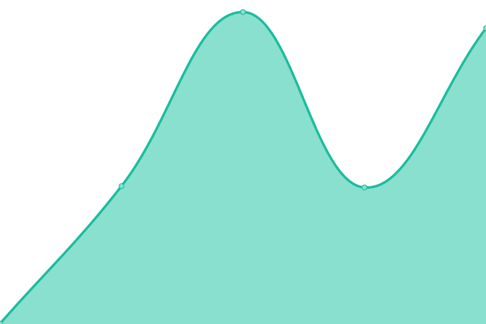 500ms
     
 | 

<a href="https://upptime.outercore.ai/history/libp2p-io">100.00%</a>
    

|  [lilium.sh](https://lilium.sh) | 🟩 Up | [lilium-sh.yml](https://github.com/vesahc/upptime-pln/commits/HEAD/history/lilium-sh.yml) | 

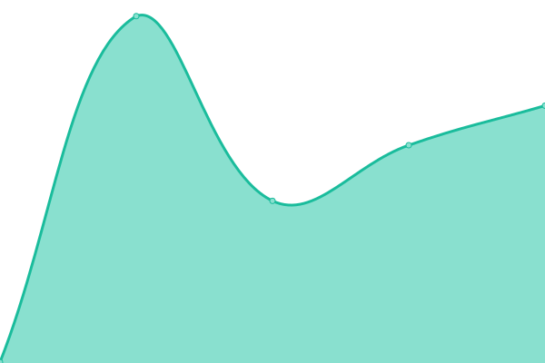 563ms
     
 | 

<a href="https://upptime.outercore.ai/history/lilium-sh">100.00%</a>
    

|  [microgen.site](https://microgen.site) | 🟩 Up | [microgen-site.yml](https://github.com/vesahc/upptime-pln/commits/HEAD/history/microgen-site.yml) | 

 537ms
     
 | 

<a href="https://upptime.outercore.ai/history/microgen-site">100.00%</a>
    

|  [multiformats.io](https://multiformats.io) | 🟩 Up | [multiformats-io.yml](https://github.com/vesahc/upptime-pln/commits/HEAD/history/multiformats-io.yml) | 

 474ms
     
 | 

<a href="https://upptime.outercore.ai/history/multiformats-io">100.00%</a>
    

|  [networkgoods.io](https://networkgoods.io) | 🟩 Up | [networkgoods-io.yml](https://github.com/vesahc/upptime-pln/commits/HEAD/history/networkgoods-io.yml) | 

 199ms
     
 | 

<a href="https://upptime.outercore.ai/history/networkgoods-io">100.00%</a>
    

|  [nftschool.dev](https://nftschool.dev) | 🟩 Up | [nftschool-dev.yml](https://github.com/vesahc/upptime-pln/commits/HEAD/history/nftschool-dev.yml) | 

 558ms
     
 | 

<a href="https://upptime.outercore.ai/history/nftschool-dev">100.00%</a>
    

|  [nftstorage.link](https://nftstorage.link) | 🟩 Up | [nftstorage-link.yml](https://github.com/vesahc/upptime-pln/commits/HEAD/history/nftstorage-link.yml) | 

 162ms
     
 | 

<a href="https://upptime.outercore.ai/history/nftstorage-link">100.00%</a>
    

|  [peerpad.net](https://peerpad.net) | 🟩 Up | [peerpad-net.yml](https://github.com/vesahc/upptime-pln/commits/HEAD/history/peerpad-net.yml) | 

 172ms
     
 | 

<a href="https://upptime.outercore.ai/history/peerpad-net">100.00%</a>
    

|  [pl-launchpad.io](https://pl-launchpad.io) | 🟩 Up | [pl-launchpad-io.yml](https://github.com/vesahc/upptime-pln/commits/HEAD/history/pl-launchpad-io.yml) | 

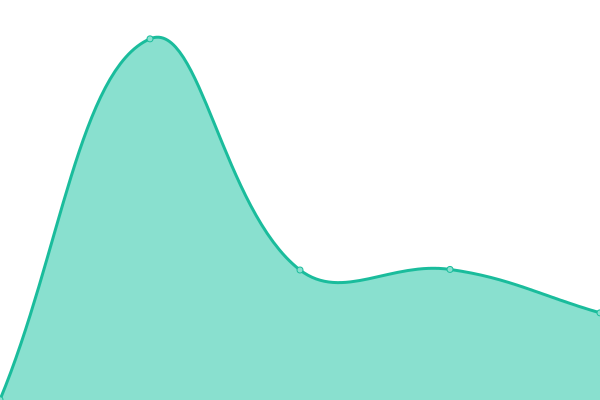 1442ms
     
 | 

<a href="https://upptime.outercore.ai/history/pl-launchpad-io">100.00%</a>
    

|  [project-repos.ipfs.io](https://project-repos.ipfs.io) | 🟩 Up | [project-repos-ipfs-io.yml](https://github.com/vesahc/upptime-pln/commits/HEAD/history/project-repos-ipfs-io.yml) | 

 116ms
     
 | 

<a href="https://upptime.outercore.ai/history/project-repos-ipfs-io">100.00%</a>
    

|  [proofs.filecoin.io](https://proofs.filecoin.io) | 🟩 Up | [proofs-filecoin-io.yml](https://github.com/vesahc/upptime-pln/commits/HEAD/history/proofs-filecoin-io.yml) | 

 274ms
     
 | 

<a href="https://upptime.outercore.ai/history/proofs-filecoin-io">100.00%</a>
    

|  [proto.school](https://proto.school) | 🟩 Up | [proto-school.yml](https://github.com/vesahc/upptime-pln/commits/HEAD/history/proto-school.yml) | 

 770ms
     
 | 

<a href="https://upptime.outercore.ai/history/proto-school">100.00%</a>
    

|  [protocol.ai](https://protocol.ai) | 🟩 Up | [protocol-ai.yml](https://github.com/vesahc/upptime-pln/commits/HEAD/history/protocol-ai.yml) | 

 493ms
     
 | 

<a href="https://upptime.outercore.ai/history/protocol-ai">100.00%</a>
    

|  [protocollabsnet.work](https://protocollabsnet.work) | 🟩 Up | [protocollabsnet-work.yml](https://github.com/vesahc/upptime-pln/commits/HEAD/history/protocollabsnet-work.yml) | 

 246ms
     
 | 

<a href="https://upptime.outercore.ai/history/protocollabsnet-work">100.00%</a>
    

|  [randomplanetfacts.xyz](https://randomplanetfacts.xyz) | 🟩 Up | [randomplanetfacts-xyz.yml](https://github.com/vesahc/upptime-pln/commits/HEAD/history/randomplanetfacts-xyz.yml) | 

 152ms
     
 | 

<a href="https://upptime.outercore.ai/history/randomplanetfacts-xyz">100.00%</a>
    

|  [recursive.ipfs.io](https://recursive.ipfs.io) | 🟩 Up | [recursive-ipfs-io.yml](https://github.com/vesahc/upptime-pln/commits/HEAD/history/recursive-ipfs-io.yml) | 

 216ms
     
 | 

<a href="https://upptime.outercore.ai/history/recursive-ipfs-io">100.00%</a>
    

|  [refs.ipfs.io](https://refs.ipfs.io) | 🟩 Up | [refs-ipfs-io.yml](https://github.com/vesahc/upptime-pln/commits/HEAD/history/refs-ipfs-io.yml) | 

 257ms
     
 | 

<a href="https://upptime.outercore.ai/history/refs-ipfs-io">100.00%</a>
    

|  [researchroadmaps.ai](https://researchroadmaps.ai) | 🟩 Up | [researchroadmaps-ai.yml](https://github.com/vesahc/upptime-pln/commits/HEAD/history/researchroadmaps-ai.yml) | 

 415ms
     
 | 

<a href="https://upptime.outercore.ai/history/researchroadmaps-ai">100.00%</a>
    

|  [retrieval.market](https://retrieval.market) | 🟩 Up | [retrieval-market.yml](https://github.com/vesahc/upptime-pln/commits/HEAD/history/retrieval-market.yml) | 

 755ms
     
 | 

<a href="https://upptime.outercore.ai/history/retrieval-market">100.00%</a>
    

|  [saft-project.com](https://saft-project.com) | 🟩 Up | [saft-project-com.yml](https://github.com/vesahc/upptime-pln/commits/HEAD/history/saft-project-com.yml) | 

 150ms
     
 | 

<a href="https://upptime.outercore.ai/history/saft-project-com">100.00%</a>
    

|  [saft-project.org](https://saft-project.org) | 🟩 Up | [saft-project-org.yml](https://github.com/vesahc/upptime-pln/commits/HEAD/history/saft-project-org.yml) | 

 121ms
     
 | 

<a href="https://upptime.outercore.ai/history/saft-project-org">100.00%</a>
    

|  [saftproject.com](https://saftproject.com) | 🟩 Up | [saftproject-com.yml](https://github.com/vesahc/upptime-pln/commits/HEAD/history/saftproject-com.yml) | 

 142ms
     
 | 

<a href="https://upptime.outercore.ai/history/saftproject-com">100.00%</a>
    

|  [saturn.tech](https://saturn.tech) | 🟩 Up | [saturn-tech.yml](https://github.com/vesahc/upptime-pln/commits/HEAD/history/saturn-tech.yml) | 

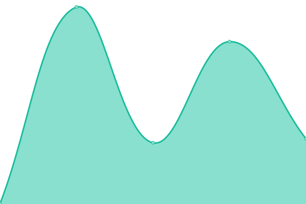 222ms
     
 | 

<a href="https://upptime.outercore.ai/history/saturn-tech">100.00%</a>
    

|  [sbs.tech](https://sbs.tech) | 🟩 Up | [sbs-tech.yml](https://github.com/vesahc/upptime-pln/commits/HEAD/history/sbs-tech.yml) | 

 630ms
     
 | 

<a href="https://upptime.outercore.ai/history/sbs-tech">100.00%</a>
    

|  [share.ipfs.io](https://share.ipfs.io) | 🟩 Up | [share-ipfs-io.yml](https://github.com/vesahc/upptime-pln/commits/HEAD/history/share-ipfs-io.yml) | 

 118ms
     
 | 

<a href="https://upptime.outercore.ai/history/share-ipfs-io">100.00%</a>
    

|  [shop.filecoin.io](https://shop.filecoin.io) | 🟩 Up | [shop-filecoin-io.yml](https://github.com/vesahc/upptime-pln/commits/HEAD/history/shop-filecoin-io.yml) | 

 445ms
     
 | 

<a href="https://upptime.outercore.ai/history/shop-filecoin-io">100.00%</a>
    

|  [shop.ipfs.io](https://shop.ipfs.io) | 🟩 Up | [shop-ipfs-io.yml](https://github.com/vesahc/upptime-pln/commits/HEAD/history/shop-ipfs-io.yml) | 

 290ms
     
 | 

<a href="https://upptime.outercore.ai/history/shop-ipfs-io">100.00%</a>
    

|  [shop.protocol.ai](https://shop.protocol.ai) | 🟩 Up | [shop-protocol-ai.yml](https://github.com/vesahc/upptime-pln/commits/HEAD/history/shop-protocol-ai.yml) | 

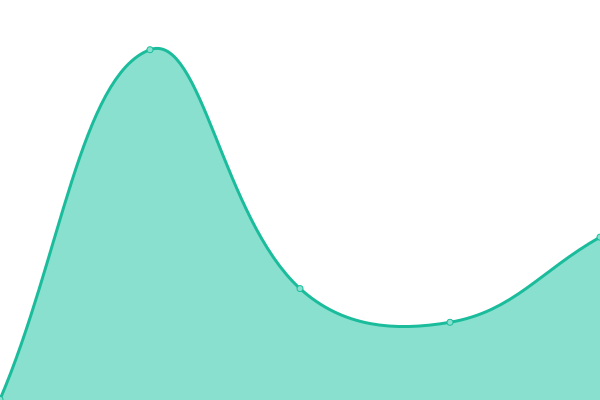 315ms
     
 | 

<a href="https://upptime.outercore.ai/history/shop-protocol-ai">100.00%</a>
    

|  [singularity.storage](https://singularity.storage) | 🟩 Up | [singularity-storage.yml](https://github.com/vesahc/upptime-pln/commits/HEAD/history/singularity-storage.yml) | 

 601ms
     
 | 

<a href="https://upptime.outercore.ai/history/singularity-storage">100.00%</a>
    

|  [slate.host](https://slate.host) | 🟩 Up | [slate-host.yml](https://github.com/vesahc/upptime-pln/commits/HEAD/history/slate-host.yml) | 

 231ms
     
 | 

<a href="https://upptime.outercore.ai/history/slate-host">100.00%</a>
    

|  [starmap.site](https://starmap.site) | 🟩 Up | [starmap-site.yml](https://github.com/vesahc/upptime-pln/commits/HEAD/history/starmap-site.yml) | 

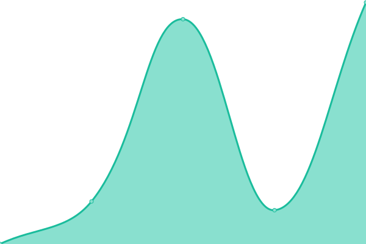 548ms
     
 | 

<a href="https://upptime.outercore.ai/history/starmap-site">100.00%</a>
    

|  [trusted-setup-snapdeals.filecoin.io](https://trusted-setup-snapdeals.filecoin.io) | 🟩 Up | [trusted-setup-snapdeals-filecoin-io.yml](https://github.com/vesahc/upptime-pln/commits/HEAD/history/trusted-setup-snapdeals-filecoin-io.yml) | 

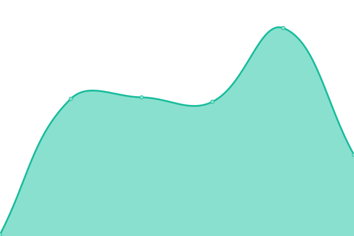 268ms
     
 | 

<a href="https://upptime.outercore.ai/history/trusted-setup-snapdeals-filecoin-io">100.00%</a>
    

|  [trusted-setup.filecoin.io](https://trusted-setup.filecoin.io) | 🟩 Up | [trusted-setup-filecoin-io.yml](https://github.com/vesahc/upptime-pln/commits/HEAD/history/trusted-setup-filecoin-io.yml) | 

 250ms
     
 | 

<a href="https://upptime.outercore.ai/history/trusted-setup-filecoin-io">100.00%</a>
    

|  [webui.ipfs.io](https://webui.ipfs.io) | 🟩 Up | [webui-ipfs-io.yml](https://github.com/vesahc/upptime-pln/commits/HEAD/history/webui-ipfs-io.yml) | 

 160ms
     
 | 

<a href="https://upptime.outercore.ai/history/webui-ipfs-io">100.00%</a>
    

|  [workshop.cluster.ipfs.io](https://workshop.cluster.ipfs.io) | 🟩 Up | [workshop-cluster-ipfs-io.yml](https://github.com/vesahc/upptime-pln/commits/HEAD/history/workshop-cluster-ipfs-io.yml) | 

 161ms
     
 | 

<a href="https://upptime.outercore.ai/history/workshop-cluster-ipfs-io">100.00%</a>
    

<!--end: status pages-->

[**Visit our status website →**](https://upptime.outercore.ai)

## 📄 License

- Powered by: [Upptime](https://github.com/upptime/upptime)
- Code: [MIT](./LICENSE) © [chase.fil](https://upptime.outercore.ai)
- Data in the `./history` directory: [Open Database License](https://opendatacommons.org/licenses/odbl/1-0/)
