# [📈 Live Status](https://upptime.outercore.ai): <!--live status--> **🟧 Partial outage**

This repository contains the open-source uptime monitor and status page for [Protocol Labs](https://upptime.outercore.ai), powered by [Upptime](https://github.com/upptime/upptime).

The [Airtable Interface](https://airtable.com/invite/l?inviteId=invVgVQUtAq60QRrA&inviteToken=db142bb642208b5ba9943e1c02ddb083db68ceef4bf45667fa7a2dd17c136b48&utm_medium=email&utm_source=product_team&utm_content=transactional-alerts) can be used to create a Pull Request to Add or Omit monitoring for specific sites, as well as to add your Github handle to receive notifications for specific sites. Please check the [Upptime Configuration](https://upptime.js.org/docs/configuration) docs for more advanced config options, some of which are included in the Airtable interface.

Do not add sites that do not exist in Airtable. They will be overwritten by an automated flow that happens weekly (currently) which collects known active domains via API. Open an issue, or contact @vesahc (@chase.fil on Slack) if you would like to add additional data sources.

Global notifications are posted to the [#upptime-pln](https://filecoinproject.slack.com/archives/C05NN527TS7) channel on Filecoin Slack.

With [Upptime](https://upptime.js.org), you can get your own unlimited and free uptime monitor and status page, powered entirely by a GitHub repository. We use [Issues](https://github.com/vesahc/upptime-pln/issues) as incident reports, [Actions](https://github.com/vesahc/upptime-pln/actions) as uptime monitors, and [Pages](https://upptime.outercore.ai) for the status page.

<!--start: status pages-->
<!-- This summary is generated by Upptime (https://github.com/upptime/upptime) -->
<!-- Do not edit this manually, your changes will be overwritten -->
<!-- prettier-ignore -->
| URL | Status | History | Response Time | Uptime |
| --- | ------ | ------- | ------------- | ------ |
|  [2019.ipfs.camp](https://2019.ipfs.camp) | 🟩 Up | [2019-ipfs-camp.yml](https://github.com/protocol/upptime-pln/commits/HEAD/history/2019-ipfs-camp.yml) | 

 1142ms
     
 | 

<a href="https://upptime.outercore.ai/history/2019-ipfs-camp">100.00%</a>
    

|  [2022.ipfs-thing.events](https://2022.ipfs-thing.events) | 🟩 Up | [2022-ipfs-thing-events.yml](https://github.com/protocol/upptime-pln/commits/HEAD/history/2022-ipfs-thing-events.yml) | 

 3135ms
     
 | 

<a href="https://upptime.outercore.ai/history/2022-ipfs-thing-events">81.81%</a>
    

|  [2022.ipfs-thing.io](https://2022.ipfs-thing.io) | 🟩 Up | [2022-ipfs-thing-io.yml](https://github.com/protocol/upptime-pln/commits/HEAD/history/2022-ipfs-thing-io.yml) | 

 376ms
     
 | 

<a href="https://upptime.outercore.ai/history/2022-ipfs-thing-io">100.00%</a>
    

|  [2022.ipfs.camp](https://2022.ipfs.camp) | 🟩 Up | [2022-ipfs-camp.yml](https://github.com/protocol/upptime-pln/commits/HEAD/history/2022-ipfs-camp.yml) | 

 963ms
     
 | 

<a href="https://upptime.outercore.ai/history/2022-ipfs-camp">100.00%</a>
    

|  [2023.ipfs-thing.io](https://2023.ipfs-thing.io) | 🟩 Up | [2023-ipfs-thing-io.yml](https://github.com/protocol/upptime-pln/commits/HEAD/history/2023-ipfs-thing-io.yml) | 

 793ms
     
 | 

<a href="https://upptime.outercore.ai/history/2023-ipfs-thing-io">100.00%</a>
    

|  [2024.ipfs.camp](https://2024.ipfs.camp) | 🟩 Up | [2024-ipfs-camp.yml](https://github.com/protocol/upptime-pln/commits/HEAD/history/2024-ipfs-camp.yml) | 

 0ms
     
 | 

<a href="https://upptime.outercore.ai/history/2024-ipfs-camp">4.27%</a>
    

|  [22.labweek.io](https://22.labweek.io) | 🟩 Up | [22-labweek-io.yml](https://github.com/protocol/upptime-pln/commits/HEAD/history/22-labweek-io.yml) | 

 243ms
     
 | 

<a href="https://upptime.outercore.ai/history/22-labweek-io">100.00%</a>
    

|  [about.ipfs.io](https://about.ipfs.io) | 🟩 Up | [about-ipfs-io.yml](https://github.com/protocol/upptime-pln/commits/HEAD/history/about-ipfs-io.yml) | 

 0ms
     
 | 

<a href="https://upptime.outercore.ai/history/about-ipfs-io">100.00%</a>
    

|  [ar.wikipedia-on-ipfs.org](https://ar.wikipedia-on-ipfs.org) | 🟩 Up | [ar-wikipedia-on-ipfs-org.yml](https://github.com/protocol/upptime-pln/commits/HEAD/history/ar-wikipedia-on-ipfs-org.yml) | 

 271ms
     
 | 

<a href="https://upptime.outercore.ai/history/ar-wikipedia-on-ipfs-org">100.00%</a>
    

|  [arewedistributedyet.com](https://arewedistributedyet.com) | 🟩 Up | [arewedistributedyet-com.yml](https://github.com/protocol/upptime-pln/commits/HEAD/history/arewedistributedyet-com.yml) | 

 306ms
     
 | 

<a href="https://upptime.outercore.ai/history/arewedistributedyet-com">100.00%</a>
    

|  [areweinterplanetaryyet.org](https://areweinterplanetaryyet.org) | 🟩 Up | [areweinterplanetaryyet-org.yml](https://github.com/protocol/upptime-pln/commits/HEAD/history/areweinterplanetaryyet-org.yml) | 

 729ms
     
 | 

<a href="https://upptime.outercore.ai/history/areweinterplanetaryyet-org">0.00%</a>
    

|  [arg.protocol.ai](https://arg.protocol.ai) | 🟩 Up | [arg-protocol-ai.yml](https://github.com/protocol/upptime-pln/commits/HEAD/history/arg-protocol-ai.yml) | 

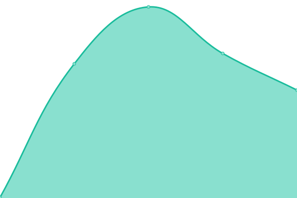 292ms
     
 | 

<a href="https://upptime.outercore.ai/history/arg-protocol-ai">100.00%</a>
    

|  [awesome.ipfs.tech](https://awesome.ipfs.tech) | 🟩 Up | [awesome-ipfs-tech.yml](https://github.com/protocol/upptime-pln/commits/HEAD/history/awesome-ipfs-tech.yml) | 

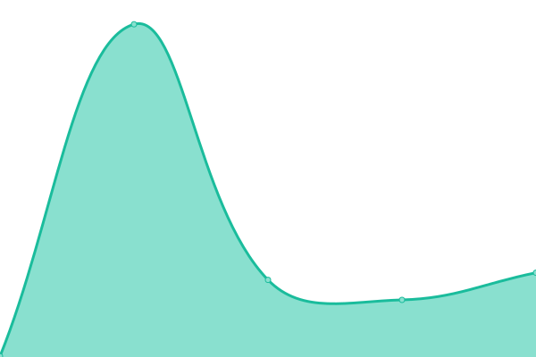 193ms
     
 | 

<a href="https://upptime.outercore.ai/history/awesome-ipfs-tech">100.00%</a>
    

|  [badbits.dwebops.pub](https://badbits.dwebops.pub) | 🟩 Up | [badbits-dwebops-pub.yml](https://github.com/protocol/upptime-pln/commits/HEAD/history/badbits-dwebops-pub.yml) | 

 183ms
     
 | 

<a href="https://upptime.outercore.ai/history/badbits-dwebops-pub">99.54%</a>
    

|  [benchmark-js.ipfs.io](https://benchmark-js.ipfs.io) | 🟩 Up | [benchmark-js-ipfs-io.yml](https://github.com/protocol/upptime-pln/commits/HEAD/history/benchmark-js-ipfs-io.yml) | 

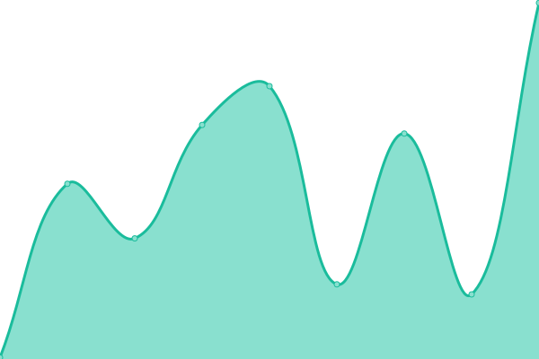 133ms
     
 | 

<a href="https://upptime.outercore.ai/history/benchmark-js-ipfs-io">99.54%</a>
    

|  [blocks.ipfs.io](https://blocks.ipfs.io) | 🟩 Up | [blocks-ipfs-io.yml](https://github.com/protocol/upptime-pln/commits/HEAD/history/blocks-ipfs-io.yml) | 

 144ms
     
 | 

<a href="https://upptime.outercore.ai/history/blocks-ipfs-io">100.00%</a>
    

|  [blog.ipfs.tech](https://blog.ipfs.tech) | 🟩 Up | [blog-ipfs-tech.yml](https://github.com/protocol/upptime-pln/commits/HEAD/history/blog-ipfs-tech.yml) | 

 88ms
     
 | 

<a href="https://upptime.outercore.ai/history/blog-ipfs-tech">100.00%</a>
    

|  [blog.libp2p.io](https://blog.libp2p.io) | 🟩 Up | [blog-libp2p-io.yml](https://github.com/protocol/upptime-pln/commits/HEAD/history/blog-libp2p-io.yml) | 

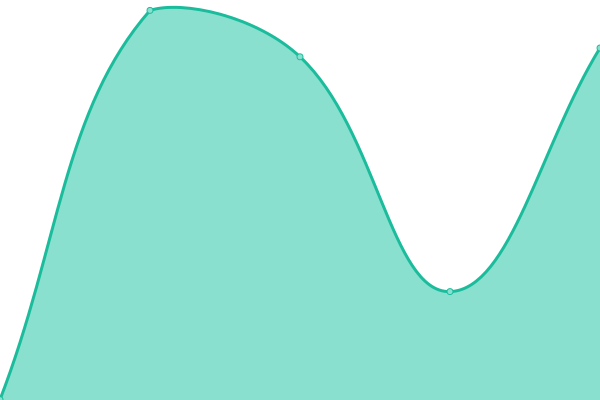 746ms
     
 | 

<a href="https://upptime.outercore.ai/history/blog-libp2p-io">100.00%</a>
    

|  [boost.filecoin.io](https://boost.filecoin.io) | 🟩 Up | [boost-filecoin-io.yml](https://github.com/protocol/upptime-pln/commits/HEAD/history/boost-filecoin-io.yml) | 

 921ms
     
 | 

<a href="https://upptime.outercore.ai/history/boost-filecoin-io">100.00%</a>
    

|  [boston23.sbs.tech](https://boston23.sbs.tech) | 🟩 Up | [boston23-sbs-tech.yml](https://github.com/protocol/upptime-pln/commits/HEAD/history/boston23-sbs-tech.yml) | 

 569ms
     
 | 

<a href="https://upptime.outercore.ai/history/boston23-sbs-tech">100.00%</a>
    

|  [breakthroughs-in-computing.labweek.io](https://breakthroughs-in-computing.labweek.io) | 🟥 Down | [breakthroughs-in-computing-labweek-io.yml](https://github.com/protocol/upptime-pln/commits/HEAD/history/breakthroughs-in-computing-labweek-io.yml) | 

 282ms
     
 | 

<a href="https://upptime.outercore.ai/history/breakthroughs-in-computing-labweek-io">0.00%</a>
    

|  [car.ipfs.io](https://car.ipfs.io) | 🟩 Up | [car-ipfs-io.yml](https://github.com/protocol/upptime-pln/commits/HEAD/history/car-ipfs-io.yml) | 

 2923ms
     
 | 

<a href="https://upptime.outercore.ai/history/car-ipfs-io">81.82%</a>
    

|  [check.ipfs.network](https://check.ipfs.network) | 🟩 Up | [check-ipfs-network.yml](https://github.com/protocol/upptime-pln/commits/HEAD/history/check-ipfs-network.yml) | 

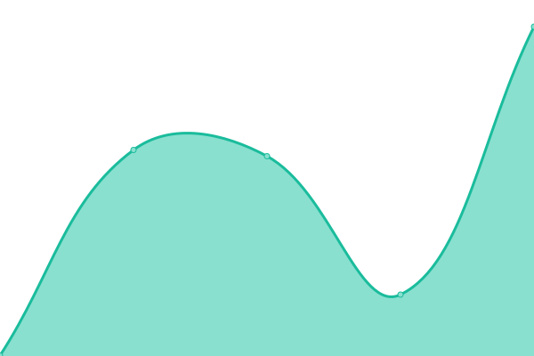 448ms
     
 | 

<a href="https://upptime.outercore.ai/history/check-ipfs-network">0.00%</a>
    

|  [cid.ipfs.io](https://cid.ipfs.io) | 🟩 Up | [cid-ipfs-io.yml](https://github.com/protocol/upptime-pln/commits/HEAD/history/cid-ipfs-io.yml) | 

 2822ms
     
 | 

<a href="https://upptime.outercore.ai/history/cid-ipfs-io">81.82%</a>
    

|  [cid.ipfs.tech](https://cid.ipfs.tech) | 🟩 Up | [cid-ipfs-tech.yml](https://github.com/protocol/upptime-pln/commits/HEAD/history/cid-ipfs-tech.yml) | 

 191ms
     
 | 

<a href="https://upptime.outercore.ai/history/cid-ipfs-tech">100.00%</a>
    

|  [collab.ipfscluster.io](https://collab.ipfscluster.io) | 🟩 Up | [collab-ipfscluster-io.yml](https://github.com/protocol/upptime-pln/commits/HEAD/history/collab-ipfscluster-io.yml) | 

 1426ms
     
 | 

<a href="https://upptime.outercore.ai/history/collab-ipfscluster-io">100.00%</a>
    

|  [conformance.ipfs.tech](https://conformance.ipfs.tech) | 🟩 Up | [conformance-ipfs-tech.yml](https://github.com/protocol/upptime-pln/commits/HEAD/history/conformance-ipfs-tech.yml) | 

 401ms
     
 | 

<a href="https://upptime.outercore.ai/history/conformance-ipfs-tech">0.00%</a>
    

|  [connectivity.libp2p.io](https://connectivity.libp2p.io) | 🟩 Up | [connectivity-libp2p-io.yml](https://github.com/protocol/upptime-pln/commits/HEAD/history/connectivity-libp2p-io.yml) | 

 756ms
     
 | 

<a href="https://upptime.outercore.ai/history/connectivity-libp2p-io">100.00%</a>
    

|  [cryptoeconlab.io](https://cryptoeconlab.io) | 🟥 Down | [cryptoeconlab-io.yml](https://github.com/protocol/upptime-pln/commits/HEAD/history/cryptoeconlab-io.yml) | 

 443ms
     
 | 

<a href="https://upptime.outercore.ai/history/cryptoeconlab-io">87.60%</a>
    

|  [dag.house](https://dag.house) | 🟩 Up | [dag-house.yml](https://github.com/protocol/upptime-pln/commits/HEAD/history/dag-house.yml) | 

 347ms
     
 | 

<a href="https://upptime.outercore.ai/history/dag-house">100.00%</a>
    

|  [dag.ipfs.io](https://dag.ipfs.io) | 🟩 Up | [dag-ipfs-io.yml](https://github.com/protocol/upptime-pln/commits/HEAD/history/dag-ipfs-io.yml) | 

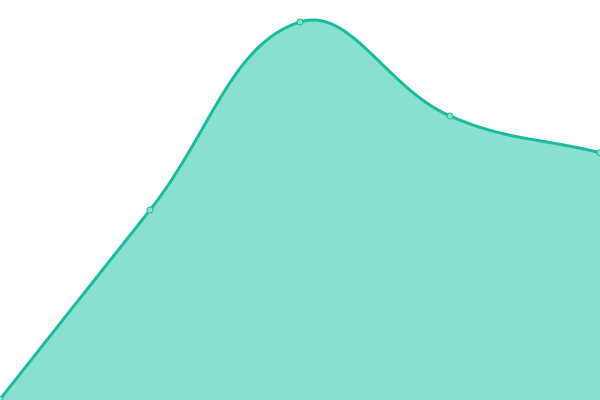 412ms
     
 | 

<a href="https://upptime.outercore.ai/history/dag-ipfs-io">100.00%</a>
    

|  [dag.ipfs.tech](https://dag.ipfs.tech) | 🟩 Up | [dag-ipfs-tech.yml](https://github.com/protocol/upptime-pln/commits/HEAD/history/dag-ipfs-tech.yml) | 

 2690ms
     
 | 

<a href="https://upptime.outercore.ai/history/dag-ipfs-tech">81.82%</a>
    

|  [data.storage.market](https://data.storage.market) | 🟥 Down | [data-storage-market.yml](https://github.com/protocol/upptime-pln/commits/HEAD/history/data-storage-market.yml) | 

 753ms
     
 | 

<a href="https://upptime.outercore.ai/history/data-storage-market">0.00%</a>
    

|  [datacapstats.io](https://datacapstats.io) | 🟩 Up | [datacapstats-io.yml](https://github.com/protocol/upptime-pln/commits/HEAD/history/datacapstats-io.yml) | 

 337ms
     
 | 

<a href="https://upptime.outercore.ai/history/datacapstats-io">100.00%</a>
    

|  [datasets.filecoin.io](https://datasets.filecoin.io) | 🟩 Up | [datasets-filecoin-io.yml](https://github.com/protocol/upptime-pln/commits/HEAD/history/datasets-filecoin-io.yml) | 

 189ms
     
 | 

<a href="https://upptime.outercore.ai/history/datasets-filecoin-io">100.00%</a>
    

|  [datatogether.org](https://datatogether.org) | 🟩 Up | [datatogether-org.yml](https://github.com/protocol/upptime-pln/commits/HEAD/history/datatogether-org.yml) | 

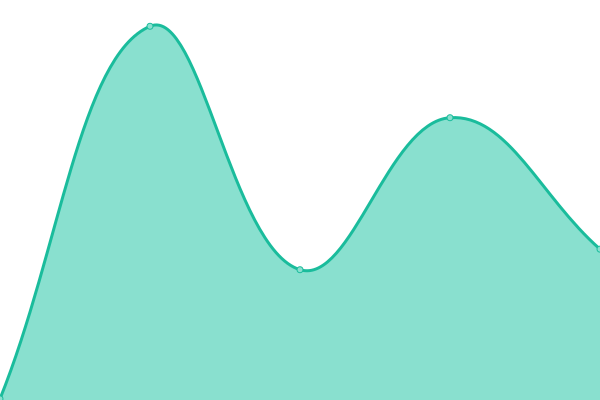 205ms
     
 | 

<a href="https://upptime.outercore.ai/history/datatogether-org">100.00%</a>
    

|  [destor.com](https://destor.com) | 🟩 Up | [destor-com.yml](https://github.com/protocol/upptime-pln/commits/HEAD/history/destor-com.yml) | 

 196ms
     
 | 

<a href="https://upptime.outercore.ai/history/destor-com">100.00%</a>
    

|  [dev.plnetwork.io](https://dev.plnetwork.io) | 🟩 Up | [dev-plnetwork-io.yml](https://github.com/protocol/upptime-pln/commits/HEAD/history/dev-plnetwork-io.yml) | 

 224ms
     
 | 

<a href="https://upptime.outercore.ai/history/dev-plnetwork-io">100.00%</a>
    

|  [dev.webui.ipfs.io](https://dev.webui.ipfs.io) | 🟩 Up | [dev-webui-ipfs-io.yml](https://github.com/protocol/upptime-pln/commits/HEAD/history/dev-webui-ipfs-io.yml) | 

 107ms
     
 | 

<a href="https://upptime.outercore.ai/history/dev-webui-ipfs-io">54.94%</a>
    

|  [discuss.ipfs.tech](https://discuss.ipfs.tech) | 🟩 Up | [discuss-ipfs-tech.yml](https://github.com/protocol/upptime-pln/commits/HEAD/history/discuss-ipfs-tech.yml) | 

 382ms
     
 | 

<a href="https://upptime.outercore.ai/history/discuss-ipfs-tech">78.83%</a>
    

|  [discuss.libp2p.io](https://discuss.libp2p.io) | 🟩 Up | [discuss-libp2p-io.yml](https://github.com/protocol/upptime-pln/commits/HEAD/history/discuss-libp2p-io.yml) | 

 319ms
     
 | 

<a href="https://upptime.outercore.ai/history/discuss-libp2p-io">0.00%</a>
    

|  [dist.ipfs.tech](https://dist.ipfs.tech) | 🟩 Up | [dist-ipfs-tech.yml](https://github.com/protocol/upptime-pln/commits/HEAD/history/dist-ipfs-tech.yml) | 

 15ms
     
 | 

<a href="https://upptime.outercore.ai/history/dist-ipfs-tech">64.91%</a>
    

|  [dnslink.dev](https://dnslink.dev) | 🟥 Down | [dnslink-dev.yml](https://github.com/protocol/upptime-pln/commits/HEAD/history/dnslink-dev.yml) | 

 0ms
     
 | 

<a href="https://upptime.outercore.ai/history/dnslink-dev">100.00%</a>
    

|  [dnslink.io](https://dnslink.io) | 🟩 Up | [dnslink-io.yml](https://github.com/protocol/upptime-pln/commits/HEAD/history/dnslink-io.yml) | 

 2859ms
     
 | 

<a href="https://upptime.outercore.ai/history/dnslink-io">99.85%</a>
    

|  [dnslink.org](https://dnslink.org) | 🟩 Up | [dnslink-org.yml](https://github.com/protocol/upptime-pln/commits/HEAD/history/dnslink-org.yml) | 

 267ms
     
 | 

<a href="https://upptime.outercore.ai/history/dnslink-org">81.83%</a>
    

|  [docs.filecoin.io](https://docs.filecoin.io) | 🟩 Up | [docs-filecoin-io.yml](https://github.com/protocol/upptime-pln/commits/HEAD/history/docs-filecoin-io.yml) | 

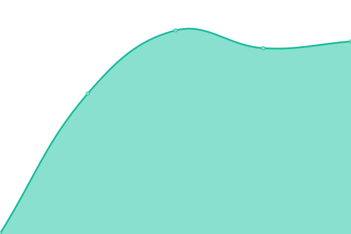 540ms
     
 | 

<a href="https://upptime.outercore.ai/history/docs-filecoin-io">100.00%</a>
    

|  [docs.ipfs.tech](https://docs.ipfs.tech) | 🟩 Up | [docs-ipfs-tech.yml](https://github.com/protocol/upptime-pln/commits/HEAD/history/docs-ipfs-tech.yml) | 

 38ms
     
 | 

<a href="https://upptime.outercore.ai/history/docs-ipfs-tech">100.00%</a>
    

|  [docs.libp2p.io](https://docs.libp2p.io) | 🟩 Up | [docs-libp2p-io.yml](https://github.com/protocol/upptime-pln/commits/HEAD/history/docs-libp2p-io.yml) | 

 635ms
     
 | 

<a href="https://upptime.outercore.ai/history/docs-libp2p-io">100.00%</a>
    

|  [docs.testground.ai](https://docs.testground.ai) | 🟩 Up | [docs-testground-ai.yml](https://github.com/protocol/upptime-pln/commits/HEAD/history/docs-testground-ai.yml) | 

 182ms
     
 | 

<a href="https://upptime.outercore.ai/history/docs-testground-ai">100.00%</a>
    

|  [drand.love](https://drand.love) | 🟩 Up | [drand-love.yml](https://github.com/protocol/upptime-pln/commits/HEAD/history/drand-love.yml) | 

 154ms
     
 | 

<a href="https://upptime.outercore.ai/history/drand-love">100.00%</a>
    

|  [dweb-primer.ipfs.io](https://dweb-primer.ipfs.io) | 🟩 Up | [dweb-primer-ipfs-io.yml](https://github.com/protocol/upptime-pln/commits/HEAD/history/dweb-primer-ipfs-io.yml) | 

 897ms
     
 | 

<a href="https://upptime.outercore.ai/history/dweb-primer-ipfs-io">100.00%</a>
    

|  [earth23.sbs.tech](https://earth23.sbs.tech) | 🟥 Down | [earth23-sbs-tech.yml](https://github.com/protocol/upptime-pln/commits/HEAD/history/earth23-sbs-tech.yml) | 

 156ms
     
 | 

<a href="https://upptime.outercore.ai/history/earth23-sbs-tech">59.02%</a>
    

|  [ecosystem.ipfs.io](https://ecosystem.ipfs.io) | 🟩 Up | [ecosystem-ipfs-io.yml](https://github.com/protocol/upptime-pln/commits/HEAD/history/ecosystem-ipfs-io.yml) | 

 462ms
     
 | 

<a href="https://upptime.outercore.ai/history/ecosystem-ipfs-io">0.00%</a>
    

|  [ecosystem.ipfs.tech](https://ecosystem.ipfs.tech) | 🟩 Up | [ecosystem-ipfs-tech.yml](https://github.com/protocol/upptime-pln/commits/HEAD/history/ecosystem-ipfs-tech.yml) | 

 296ms
     
 | 

<a href="https://upptime.outercore.ai/history/ecosystem-ipfs-tech">100.00%</a>
    

|  [elegant-glowing.plnetwork.io](https://elegant-glowing.plnetwork.io) | 🟩 Up | [elegant-glowing-plnetwork-io.yml](https://github.com/protocol/upptime-pln/commits/HEAD/history/elegant-glowing-plnetwork-io.yml) | 

 404ms
     
 | 

<a href="https://upptime.outercore.ai/history/elegant-glowing-plnetwork-io">100.00%</a>
    

|  [en.wikipedia-on-ipfs.org](https://en.wikipedia-on-ipfs.org) | 🟩 Up | [en-wikipedia-on-ipfs-org.yml](https://github.com/protocol/upptime-pln/commits/HEAD/history/en-wikipedia-on-ipfs-org.yml) | 

 233ms
     
 | 

<a href="https://upptime.outercore.ai/history/en-wikipedia-on-ipfs-org">99.84%</a>
    

|  [ethdenver.ipc.space](https://ethdenver.ipc.space) | 🟥 Down | [ethdenver-ipc-space.yml](https://github.com/protocol/upptime-pln/commits/HEAD/history/ethdenver-ipc-space.yml) | 

 0ms
     
 | 

<a href="https://upptime.outercore.ai/history/ethdenver-ipc-space">0.00%</a>
    

|  [events.plnetwork.io](https://events.plnetwork.io) | 🟩 Up | [events-plnetwork-io.yml](https://github.com/protocol/upptime-pln/commits/HEAD/history/events-plnetwork-io.yml) | 

 1017ms
     
 | 

<a href="https://upptime.outercore.ai/history/events-plnetwork-io">100.00%</a>
    

|  [explore.ipld.io](https://explore.ipld.io) | 🟩 Up | [explore-ipld-io.yml](https://github.com/protocol/upptime-pln/commits/HEAD/history/explore-ipld-io.yml) | 

 421ms
     
 | 

<a href="https://upptime.outercore.ai/history/explore-ipld-io">100.00%</a>
    

|  [fa.wikipedia-on-ipfs.org](https://fa.wikipedia-on-ipfs.org) | 🟩 Up | [fa-wikipedia-on-ipfs-org.yml](https://github.com/protocol/upptime-pln/commits/HEAD/history/fa-wikipedia-on-ipfs-org.yml) | 

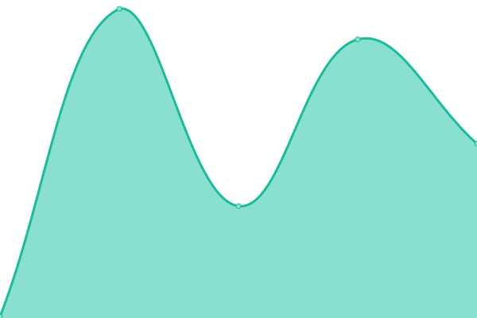 172ms
     
 | 

<a href="https://upptime.outercore.ai/history/fa-wikipedia-on-ipfs-org">100.00%</a>
    

|  [fil-safts.com](https://fil-safts.com) | 🟩 Up | [fil-safts-com.yml](https://github.com/protocol/upptime-pln/commits/HEAD/history/fil-safts-com.yml) | 

 212ms
     
 | 

<a href="https://upptime.outercore.ai/history/fil-safts-com">100.00%</a>
    

|  [fil.page](https://fil.page) | 🟥 Down | [fil-page.yml](https://github.com/protocol/upptime-pln/commits/HEAD/history/fil-page.yml) | 

 320ms
     
 | 

<a href="https://upptime.outercore.ai/history/fil-page">38.35%</a>
    

|  [filecoin-explorer.com](https://filecoin-explorer.com) | 🟩 Up | [filecoin-explorer-com.yml](https://github.com/protocol/upptime-pln/commits/HEAD/history/filecoin-explorer-com.yml) | 

 213ms
     
 | 

<a href="https://upptime.outercore.ai/history/filecoin-explorer-com">100.00%</a>
    

|  [filecoin-tracker.com](https://filecoin-tracker.com) | 🟥 Down | [filecoin-tracker-com.yml](https://github.com/protocol/upptime-pln/commits/HEAD/history/filecoin-tracker-com.yml) | 

 513ms
     
 | 

<a href="https://upptime.outercore.ai/history/filecoin-tracker-com">0.00%</a>
    

|  [filecoin.io](https://filecoin.io) | 🟩 Up | [filecoin-io.yml](https://github.com/protocol/upptime-pln/commits/HEAD/history/filecoin-io.yml) | 

 238ms
     
 | 

<a href="https://upptime.outercore.ai/history/filecoin-io">0.00%</a>
    

|  [filecoindata.tools](https://filecoindata.tools) | 🟩 Up | [filecoindata-tools.yml](https://github.com/protocol/upptime-pln/commits/HEAD/history/filecoindata-tools.yml) | 

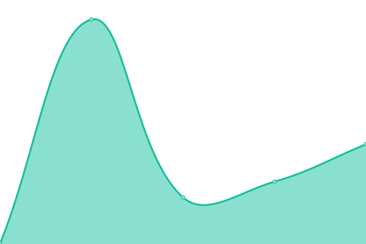 400ms
     
 | 

<a href="https://upptime.outercore.ai/history/filecoindata-tools">100.00%</a>
    

|  [filecointldr.io](https://filecointldr.io) | 🟩 Up | [filecointldr-io.yml](https://github.com/protocol/upptime-pln/commits/HEAD/history/filecointldr-io.yml) | 

 344ms
     
 | 

<a href="https://upptime.outercore.ai/history/filecointldr-io">100.00%</a>
    

|  [filspark.com](https://filspark.com) | 🟩 Up | [filspark-com.yml](https://github.com/protocol/upptime-pln/commits/HEAD/history/filspark-com.yml) | 

 273ms
     
 | 

<a href="https://upptime.outercore.ai/history/filspark-com">100.00%</a>
    

|  [flipchart.peerpad.net](https://flipchart.peerpad.net) | 🟩 Up | [flipchart-peerpad-net.yml](https://github.com/protocol/upptime-pln/commits/HEAD/history/flipchart-peerpad-net.yml) | 

 143ms
     
 | 

<a href="https://upptime.outercore.ai/history/flipchart-peerpad-net">37.30%</a>
    

|  [fvm.filecoin.io](https://fvm.filecoin.io) | 🟩 Up | [fvm-filecoin-io.yml](https://github.com/protocol/upptime-pln/commits/HEAD/history/fvm-filecoin-io.yml) | 

 315ms
     
 | 

<a href="https://upptime.outercore.ai/history/fvm-filecoin-io">100.00%</a>
    

|  [helia.io](https://helia.io) | 🟩 Up | [helia-io.yml](https://github.com/protocol/upptime-pln/commits/HEAD/history/helia-io.yml) | 

 509ms
     
 | 

<a href="https://upptime.outercore.ai/history/helia-io">65.17%</a>
    

|  [igis.io](https://igis.io) | 🟩 Up | [igis-io.yml](https://github.com/protocol/upptime-pln/commits/HEAD/history/igis-io.yml) | 

 179ms
     
 | 

<a href="https://upptime.outercore.ai/history/igis-io">100.00%</a>
    

|  [impactevaluator.io](https://impactevaluator.io) | 🟩 Up | [impactevaluator-io.yml](https://github.com/protocol/upptime-pln/commits/HEAD/history/impactevaluator-io.yml) | 

 177ms
     
 | 

<a href="https://upptime.outercore.ai/history/impactevaluator-io">100.00%</a>
    

|  [ipfs-thing.events](https://ipfs-thing.events) | 🟩 Up | [ipfs-thing-events.yml](https://github.com/protocol/upptime-pln/commits/HEAD/history/ipfs-thing-events.yml) | 

 844ms
     
 | 

<a href="https://upptime.outercore.ai/history/ipfs-thing-events">99.91%</a>
    

|  [ipfs.impactevaluator.io](https://ipfs.impactevaluator.io) | 🟩 Up | [ipfs-impactevaluator-io.yml](https://github.com/protocol/upptime-pln/commits/HEAD/history/ipfs-impactevaluator-io.yml) | 

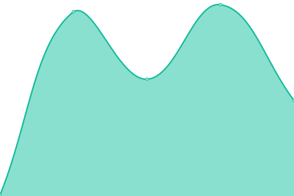 188ms
     
 | 

<a href="https://upptime.outercore.ai/history/ipfs-impactevaluator-io">100.00%</a>
    

|  [ipfs.network](https://ipfs.network) | 🟩 Up | [ipfs-network.yml](https://github.com/protocol/upptime-pln/commits/HEAD/history/ipfs-network.yml) | 

 440ms
     
 | 

<a href="https://upptime.outercore.ai/history/ipfs-network">100.00%</a>
    

|  [ipfs.tech](https://ipfs.tech) | 🟩 Up | [ipfs-tech.yml](https://github.com/protocol/upptime-pln/commits/HEAD/history/ipfs-tech.yml) | 

 437ms
     
 | 

<a href="https://upptime.outercore.ai/history/ipfs-tech">100.00%</a>
    

|  [ipfscluster.io](https://ipfscluster.io) | 🟩 Up | [ipfscluster-io.yml](https://github.com/protocol/upptime-pln/commits/HEAD/history/ipfscluster-io.yml) | 

 190ms
     
 | 

<a href="https://upptime.outercore.ai/history/ipfscluster-io">99.92%</a>
    

|  [ipfspinningsummit.com](https://ipfspinningsummit.com) | 🟥 Down | [ipfspinningsummit-com.yml](https://github.com/protocol/upptime-pln/commits/HEAD/history/ipfspinningsummit-com.yml) | 

 543ms
     
 | 

<a href="https://upptime.outercore.ai/history/ipfspinningsummit-com">20.40%</a>
    

|  [ipld.io](https://ipld.io) | 🟩 Up | [ipld-io.yml](https://github.com/protocol/upptime-pln/commits/HEAD/history/ipld-io.yml) | 

 875ms
     
 | 

<a href="https://upptime.outercore.ai/history/ipld-io">0.00%</a>
    

|  [istanbul.ipc.space](https://istanbul.ipc.space) | 🟥 Down | [istanbul-ipc-space.yml](https://github.com/protocol/upptime-pln/commits/HEAD/history/istanbul-ipc-space.yml) | 

 0ms
     
 | 

<a href="https://upptime.outercore.ai/history/istanbul-ipc-space">0.00%</a>
    

|  [js.ipfs.io](https://js.ipfs.io) | 🟥 Down | [js-ipfs-io.yml](https://github.com/protocol/upptime-pln/commits/HEAD/history/js-ipfs-io.yml) | 

 0ms
     
 | 

<a href="https://upptime.outercore.ai/history/js-ipfs-io">0.00%</a>
    

|  [js.ipfs.tech](https://js.ipfs.tech) | 🟩 Up | [js-ipfs-tech.yml](https://github.com/protocol/upptime-pln/commits/HEAD/history/js-ipfs-tech.yml) | 

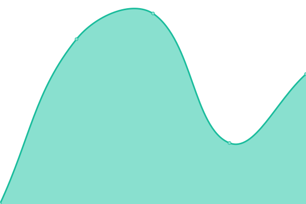 670ms
     
 | 

<a href="https://upptime.outercore.ai/history/js-ipfs-tech">0.00%</a>
    

|  [labweek.io](https://labweek.io) | 🟩 Up | [labweek-io.yml](https://github.com/protocol/upptime-pln/commits/HEAD/history/labweek-io.yml) | 

 0ms
     
 | 

<a href="https://upptime.outercore.ai/history/labweek-io">100.00%</a>
    

|  [latam22.sbs.tech](https://latam22.sbs.tech) | 🟩 Up | [latam22-sbs-tech.yml](https://github.com/protocol/upptime-pln/commits/HEAD/history/latam22-sbs-tech.yml) | 

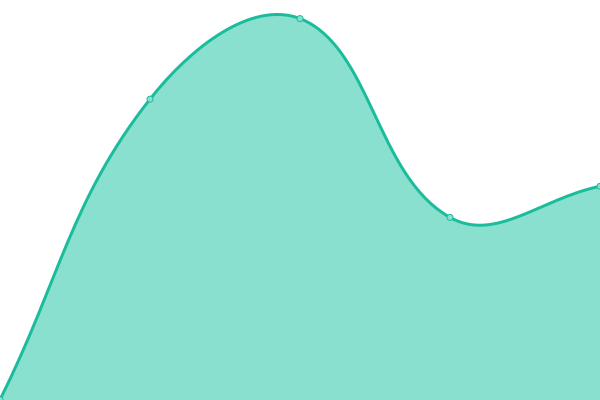 944ms
     
 | 

<a href="https://upptime.outercore.ai/history/latam22-sbs-tech">100.00%</a>
    

|  [legacy.starmap.site](https://legacy.starmap.site) | 🟩 Up | [legacy-starmap-site.yml](https://github.com/protocol/upptime-pln/commits/HEAD/history/legacy-starmap-site.yml) | 

 3802ms
     
 | 

<a href="https://upptime.outercore.ai/history/legacy-starmap-site">100.00%</a>
    

|  [libp2p.io](https://libp2p.io) | 🟩 Up | [libp2p-io.yml](https://github.com/protocol/upptime-pln/commits/HEAD/history/libp2p-io.yml) | 

 477ms
     
 | 

<a href="https://upptime.outercore.ai/history/libp2p-io">100.00%</a>
    

|  [liftoff.filecoin.io](https://liftoff.filecoin.io) | 🟩 Up | [liftoff-filecoin-io.yml](https://github.com/protocol/upptime-pln/commits/HEAD/history/liftoff-filecoin-io.yml) | 

 323ms
     
 | 

<a href="https://upptime.outercore.ai/history/liftoff-filecoin-io">100.00%</a>
    

|  [lilium.sh](https://lilium.sh) | 🟩 Up | [lilium-sh.yml](https://github.com/protocol/upptime-pln/commits/HEAD/history/lilium-sh.yml) | 

 305ms
     
 | 

<a href="https://upptime.outercore.ai/history/lilium-sh">0.00%</a>
    

|  [lotus.filecoin.io](https://lotus.filecoin.io) | 🟩 Up | [lotus-filecoin-io.yml](https://github.com/protocol/upptime-pln/commits/HEAD/history/lotus-filecoin-io.yml) | 

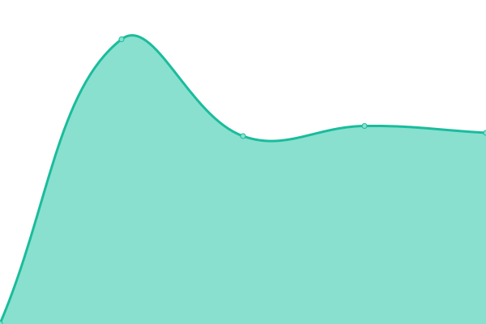 532ms
     
 | 

<a href="https://upptime.outercore.ai/history/lotus-filecoin-io">100.00%</a>
    

|  [microgen.site](https://microgen.site) | 🟩 Up | [microgen-site.yml](https://github.com/protocol/upptime-pln/commits/HEAD/history/microgen-site.yml) | 

 435ms
     
 | 

<a href="https://upptime.outercore.ai/history/microgen-site">74.67%</a>
    

|  [mta-sts.destor.com](https://mta-sts.destor.com) | 🟥 Down | [mta-sts-destor-com.yml](https://github.com/protocol/upptime-pln/commits/HEAD/history/mta-sts-destor-com.yml) | 

 0ms
     
 | 

<a href="https://upptime.outercore.ai/history/mta-sts-destor-com">100.00%</a>
    

|  [multiformats.io](https://multiformats.io) | 🟩 Up | [multiformats-io.yml](https://github.com/protocol/upptime-pln/commits/HEAD/history/multiformats-io.yml) | 

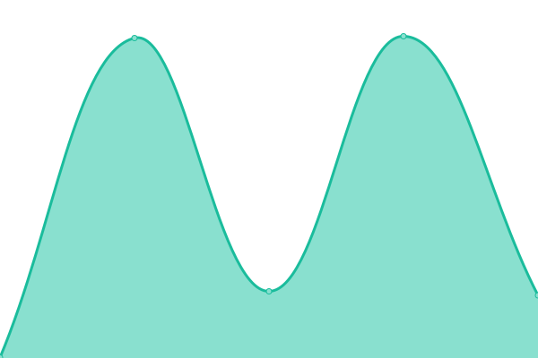 431ms
     
 | 

<a href="https://upptime.outercore.ai/history/multiformats-io">100.00%</a>
    

|  [my.wikipedia-on-ipfs.org](https://my.wikipedia-on-ipfs.org) | 🟩 Up | [my-wikipedia-on-ipfs-org.yml](https://github.com/protocol/upptime-pln/commits/HEAD/history/my-wikipedia-on-ipfs-org.yml) | 

 89ms
     
 | 

<a href="https://upptime.outercore.ai/history/my-wikipedia-on-ipfs-org">96.13%</a>
    

|  [nft.storage](https://nft.storage) | 🟩 Up | [nft-storage.yml](https://github.com/protocol/upptime-pln/commits/HEAD/history/nft-storage.yml) | 

 330ms
     
 | 

<a href="https://upptime.outercore.ai/history/nft-storage">100.00%</a>
    

|  [nftstorage.link](https://nftstorage.link) | 🟩 Up | [nftstorage-link.yml](https://github.com/protocol/upptime-pln/commits/HEAD/history/nftstorage-link.yml) | 

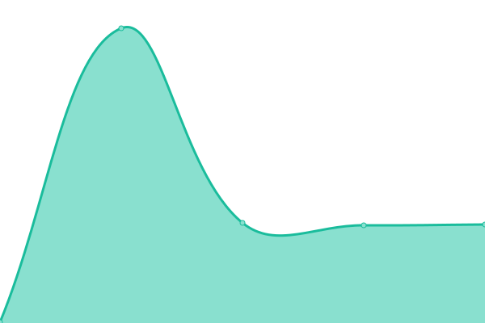 183ms
     
 | 

<a href="https://upptime.outercore.ai/history/nftstorage-link">100.00%</a>
    

|  [nomios.io](https://nomios.io) | 🟩 Up | [nomios-io.yml](https://github.com/protocol/upptime-pln/commits/HEAD/history/nomios-io.yml) | 

 0ms
     
 | 

<a href="https://upptime.outercore.ai/history/nomios-io">100.00%</a>
    

|  [paris22.sbs.tech](https://paris22.sbs.tech) | 🟩 Up | [paris22-sbs-tech.yml](https://github.com/protocol/upptime-pln/commits/HEAD/history/paris22-sbs-tech.yml) | 

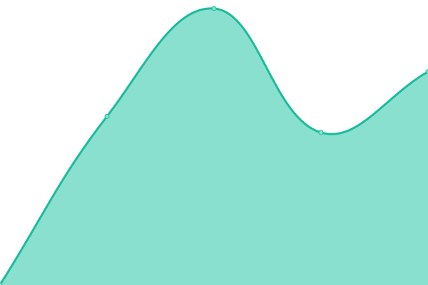 854ms
     
 | 

<a href="https://upptime.outercore.ai/history/paris22-sbs-tech">0.00%</a>
    

|  [pastelock.drand.love](https://pastelock.drand.love) | 🟩 Up | [pastelock-drand-love.yml](https://github.com/protocol/upptime-pln/commits/HEAD/history/pastelock-drand-love.yml) | 

 281ms
     
 | 

<a href="https://upptime.outercore.ai/history/pastelock-drand-love">100.00%</a>
    

|  [peerpad.net](https://peerpad.net) | 🟩 Up | [peerpad-net.yml](https://github.com/protocol/upptime-pln/commits/HEAD/history/peerpad-net.yml) | 

 131ms
     
 | 

<a href="https://upptime.outercore.ai/history/peerpad-net">33.51%</a>
    

|  [pl-launchpad.io](https://pl-launchpad.io) | 🟩 Up | [pl-launchpad-io.yml](https://github.com/protocol/upptime-pln/commits/HEAD/history/pl-launchpad-io.yml) | 

 620ms
     
 | 

<a href="https://upptime.outercore.ai/history/pl-launchpad-io">0.00%</a>
    

|  [pln.world](https://pln.world) | 🟩 Up | [pln-world.yml](https://github.com/protocol/upptime-pln/commits/HEAD/history/pln-world.yml) | 

 0ms
     
 | 

<a href="https://upptime.outercore.ai/history/pln-world">100.00%</a>
    

|  [project-repos.ipfs.io](https://project-repos.ipfs.io) | 🟩 Up | [project-repos-ipfs-io.yml](https://github.com/protocol/upptime-pln/commits/HEAD/history/project-repos-ipfs-io.yml) | 

 107ms
     
 | 

<a href="https://upptime.outercore.ai/history/project-repos-ipfs-io">33.51%</a>
    

|  [proofs.filecoin.io](https://proofs.filecoin.io) | 🟩 Up | [proofs-filecoin-io.yml](https://github.com/protocol/upptime-pln/commits/HEAD/history/proofs-filecoin-io.yml) | 

 133ms
     
 | 

<a href="https://upptime.outercore.ai/history/proofs-filecoin-io">0.00%</a>
    

|  [proto.school](https://proto.school) | 🟩 Up | [proto-school.yml](https://github.com/protocol/upptime-pln/commits/HEAD/history/proto-school.yml) | 

 496ms
     
 | 

<a href="https://upptime.outercore.ai/history/proto-school">13.49%</a>
    

|  [recursive.ipfs.io](https://recursive.ipfs.io) | 🟩 Up | [recursive-ipfs-io.yml](https://github.com/protocol/upptime-pln/commits/HEAD/history/recursive-ipfs-io.yml) | 

 106ms
     
 | 

<a href="https://upptime.outercore.ai/history/recursive-ipfs-io">99.67%</a>
    

|  [refs.ipfs.io](https://refs.ipfs.io) | 🟩 Up | [refs-ipfs-io.yml](https://github.com/protocol/upptime-pln/commits/HEAD/history/refs-ipfs-io.yml) | 

 114ms
     
 | 

<a href="https://upptime.outercore.ai/history/refs-ipfs-io">99.67%</a>
    

|  [research.protocol.ai](https://research.protocol.ai) | 🟩 Up | [research-protocol-ai.yml](https://github.com/protocol/upptime-pln/commits/HEAD/history/research-protocol-ai.yml) | 

 781ms
     
 | 

<a href="https://upptime.outercore.ai/history/research-protocol-ai">0.00%</a>
    

|  [ru.wikipedia-on-ipfs.org](https://ru.wikipedia-on-ipfs.org) | 🟩 Up | [ru-wikipedia-on-ipfs-org.yml](https://github.com/protocol/upptime-pln/commits/HEAD/history/ru-wikipedia-on-ipfs-org.yml) | 

 124ms
     
 | 

<a href="https://upptime.outercore.ai/history/ru-wikipedia-on-ipfs-org">100.00%</a>
    

|  [safe.filecoin.io](https://safe.filecoin.io) | 🟩 Up | [safe-filecoin-io.yml](https://github.com/protocol/upptime-pln/commits/HEAD/history/safe-filecoin-io.yml) | 

 0ms
     
 | 

<a href="https://upptime.outercore.ai/history/safe-filecoin-io">100.00%</a>
    

|  [saft-project.com](https://saft-project.com) | 🟩 Up | [saft-project-com.yml](https://github.com/protocol/upptime-pln/commits/HEAD/history/saft-project-com.yml) | 

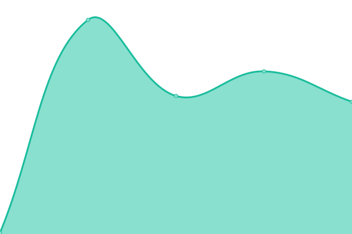 138ms
     
 | 

<a href="https://upptime.outercore.ai/history/saft-project-com">100.00%</a>
    

|  [saft-project.org](https://saft-project.org) | 🟩 Up | [saft-project-org.yml](https://github.com/protocol/upptime-pln/commits/HEAD/history/saft-project-org.yml) | 

 220ms
     
 | 

<a href="https://upptime.outercore.ai/history/saft-project-org">100.00%</a>
    

|  [saftproject.com](https://saftproject.com) | 🟩 Up | [saftproject-com.yml](https://github.com/protocol/upptime-pln/commits/HEAD/history/saftproject-com.yml) | 

 131ms
     
 | 

<a href="https://upptime.outercore.ai/history/saftproject-com">100.00%</a>
    

|  [saturn.tech](https://saturn.tech) | 🟩 Up | [saturn-tech.yml](https://github.com/protocol/upptime-pln/commits/HEAD/history/saturn-tech.yml) | 

 417ms
     
 | 

<a href="https://upptime.outercore.ai/history/saturn-tech">100.00%</a>
    

|  [sbs.tech](https://sbs.tech) | 🟥 Down | [sbs-tech.yml](https://github.com/protocol/upptime-pln/commits/HEAD/history/sbs-tech.yml) | 

 350ms
     
 | 

<a href="https://upptime.outercore.ai/history/sbs-tech">58.12%</a>
    

|  [share.ipfs.io](https://share.ipfs.io) | 🟩 Up | [share-ipfs-io.yml](https://github.com/protocol/upptime-pln/commits/HEAD/history/share-ipfs-io.yml) | 

 500ms
     
 | 

<a href="https://upptime.outercore.ai/history/share-ipfs-io">100.00%</a>
    

|  [shop.filecoin.io](https://shop.filecoin.io) | 🟩 Up | [shop-filecoin-io.yml](https://github.com/protocol/upptime-pln/commits/HEAD/history/shop-filecoin-io.yml) | 

 143ms
     
 | 

<a href="https://upptime.outercore.ai/history/shop-filecoin-io">100.00%</a>
    

|  [shop.ipfs.io](https://shop.ipfs.io) | 🟩 Up | [shop-ipfs-io.yml](https://github.com/protocol/upptime-pln/commits/HEAD/history/shop-ipfs-io.yml) | 

 205ms
     
 | 

<a href="https://upptime.outercore.ai/history/shop-ipfs-io">100.00%</a>
    

|  [shop.protocol.ai](https://shop.protocol.ai) | 🟩 Up | [shop-protocol-ai.yml](https://github.com/protocol/upptime-pln/commits/HEAD/history/shop-protocol-ai.yml) | 

 307ms
     
 | 

<a href="https://upptime.outercore.ai/history/shop-protocol-ai">100.00%</a>
    

|  [singularity.storage](https://singularity.storage) | 🟩 Up | [singularity-storage.yml](https://github.com/protocol/upptime-pln/commits/HEAD/history/singularity-storage.yml) | 

 311ms
     
 | 

<a href="https://upptime.outercore.ai/history/singularity-storage">20.65%</a>
    

|  [spaceport.cloud](https://spaceport.cloud) | 🟩 Up | [spaceport-cloud.yml](https://github.com/protocol/upptime-pln/commits/HEAD/history/spaceport-cloud.yml) | 

 0ms
     
 | 

<a href="https://upptime.outercore.ai/history/spaceport-cloud">100.00%</a>
    

|  [spacewarp.fvm.dev](https://spacewarp.fvm.dev) | 🟩 Up | [spacewarp-fvm-dev.yml](https://github.com/protocol/upptime-pln/commits/HEAD/history/spacewarp-fvm-dev.yml) | 

 1525ms
     
 | 

<a href="https://upptime.outercore.ai/history/spacewarp-fvm-dev">100.00%</a>
    

|  [spec.filecoin.io](https://spec.filecoin.io) | 🟩 Up | [spec-filecoin-io.yml](https://github.com/protocol/upptime-pln/commits/HEAD/history/spec-filecoin-io.yml) | 

 411ms
     
 | 

<a href="https://upptime.outercore.ai/history/spec-filecoin-io">0.00%</a>
    

|  [specs.ipfs.tech](https://specs.ipfs.tech) | 🟩 Up | [specs-ipfs-tech.yml](https://github.com/protocol/upptime-pln/commits/HEAD/history/specs-ipfs-tech.yml) | 

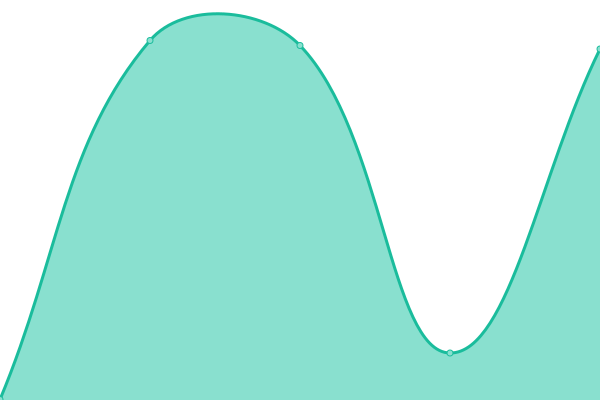 556ms
     
 | 

<a href="https://upptime.outercore.ai/history/specs-ipfs-tech">0.00%</a>
    

|  [specs.ipld.io](https://specs.ipld.io) | 🟩 Up | [specs-ipld-io.yml](https://github.com/protocol/upptime-pln/commits/HEAD/history/specs-ipld-io.yml) | 

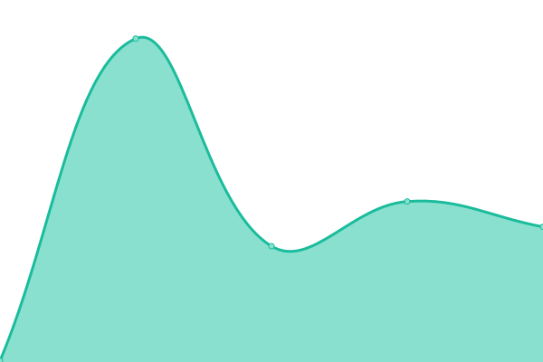 152ms
     
 | 

<a href="https://upptime.outercore.ai/history/specs-ipld-io">100.00%</a>
    

|  [staging.impactevaluator.io](https://staging.impactevaluator.io) | 🟩 Up | [staging-impactevaluator-io.yml](https://github.com/protocol/upptime-pln/commits/HEAD/history/staging-impactevaluator-io.yml) | 

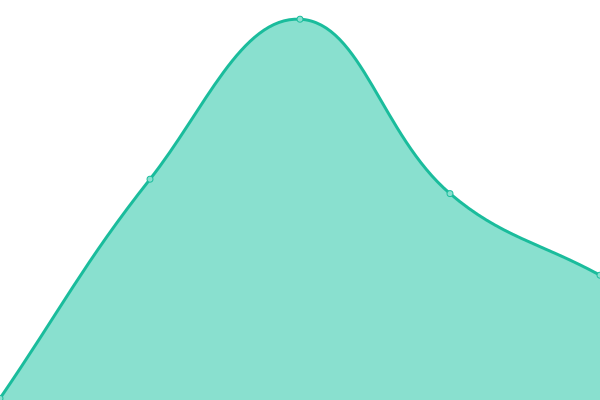 146ms
     
 | 

<a href="https://upptime.outercore.ai/history/staging-impactevaluator-io">100.00%</a>
    

|  [staging.plnetwork.io](https://staging.plnetwork.io) | 🟩 Up | [staging-plnetwork-io.yml](https://github.com/protocol/upptime-pln/commits/HEAD/history/staging-plnetwork-io.yml) | 

 150ms
     
 | 

<a href="https://upptime.outercore.ai/history/staging-plnetwork-io">100.00%</a>
    

|  [starmap.site](https://starmap.site) | 🟩 Up | [starmap-site.yml](https://github.com/protocol/upptime-pln/commits/HEAD/history/starmap-site.yml) | 

 2781ms
     
 | 

<a href="https://upptime.outercore.ai/history/starmap-site">100.00%</a>
    

|  [stats.singularity.storage](https://stats.singularity.storage) | 🟩 Up | [stats-singularity-storage.yml](https://github.com/protocol/upptime-pln/commits/HEAD/history/stats-singularity-storage.yml) | 

 243ms
     
 | 

<a href="https://upptime.outercore.ai/history/stats-singularity-storage">100.00%</a>
    

|  [status.drand.love](https://status.drand.love) | 🟩 Up | [status-drand-love.yml](https://github.com/protocol/upptime-pln/commits/HEAD/history/status-drand-love.yml) | 

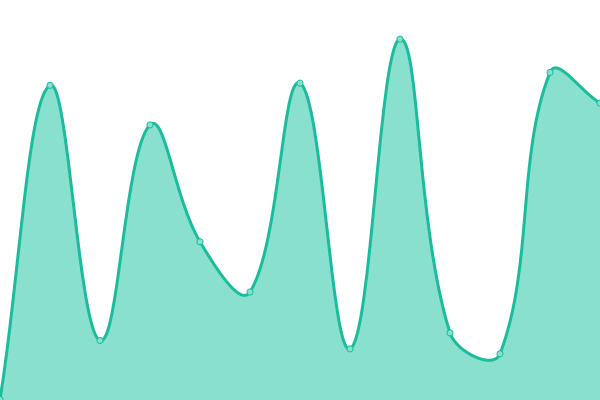 447ms
     
 | 

<a href="https://upptime.outercore.ai/history/status-drand-love">69.32%</a>
    

|  [status.filecoin.io](https://status.filecoin.io) | 🟩 Up | [status-filecoin-io.yml](https://github.com/protocol/upptime-pln/commits/HEAD/history/status-filecoin-io.yml) | 

 321ms
     
 | 

<a href="https://upptime.outercore.ai/history/status-filecoin-io">69.32%</a>
    

|  [storage.filecoin.io](https://storage.filecoin.io) | 🟩 Up | [storage-filecoin-io.yml](https://github.com/protocol/upptime-pln/commits/HEAD/history/storage-filecoin-io.yml) | 

 427ms
     
 | 

<a href="https://upptime.outercore.ai/history/storage-filecoin-io">100.00%</a>
    

|  [storage.market](https://storage.market) | 🟥 Down | [storage-market.yml](https://github.com/protocol/upptime-pln/commits/HEAD/history/storage-market.yml) | 

 612ms
     
 | 

<a href="https://upptime.outercore.ai/history/storage-market">0.00%</a>
    

|  [timeline.fvm.dev](https://timeline.fvm.dev) | 🟩 Up | [timeline-fvm-dev.yml](https://github.com/protocol/upptime-pln/commits/HEAD/history/timeline-fvm-dev.yml) | 

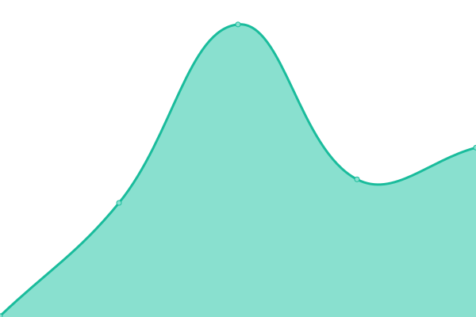 197ms
     
 | 

<a href="https://upptime.outercore.ai/history/timeline-fvm-dev">100.00%</a>
    

|  [timevault.drand.love](https://timevault.drand.love) | 🟩 Up | [timevault-drand-love.yml](https://github.com/protocol/upptime-pln/commits/HEAD/history/timevault-drand-love.yml) | 

 140ms
     
 | 

<a href="https://upptime.outercore.ai/history/timevault-drand-love">100.00%</a>
    

|  [tr.wikipedia-on-ipfs.org](https://tr.wikipedia-on-ipfs.org) | 🟩 Up | [tr-wikipedia-on-ipfs-org.yml](https://github.com/protocol/upptime-pln/commits/HEAD/history/tr-wikipedia-on-ipfs-org.yml) | 

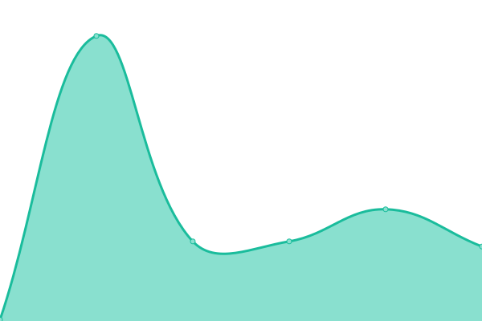 168ms
     
 | 

<a href="https://upptime.outercore.ai/history/tr-wikipedia-on-ipfs-org">100.00%</a>
    

|  [transfer.protocol.ai](https://transfer.protocol.ai) | 🟩 Up | [transfer-protocol-ai.yml](https://github.com/protocol/upptime-pln/commits/HEAD/history/transfer-protocol-ai.yml) | 

 0ms
     
 | 

<a href="https://upptime.outercore.ai/history/transfer-protocol-ai">100.00%</a>
    

|  [trusted-setup-snapdeals.filecoin.io](https://trusted-setup-snapdeals.filecoin.io) | 🟩 Up | [trusted-setup-snapdeals-filecoin-io.yml](https://github.com/protocol/upptime-pln/commits/HEAD/history/trusted-setup-snapdeals-filecoin-io.yml) | 

 134ms
     
 | 

<a href="https://upptime.outercore.ai/history/trusted-setup-snapdeals-filecoin-io">100.00%</a>
    

|  [trusted-setup.filecoin.io](https://trusted-setup.filecoin.io) | 🟩 Up | [trusted-setup-filecoin-io.yml](https://github.com/protocol/upptime-pln/commits/HEAD/history/trusted-setup-filecoin-io.yml) | 

 127ms
     
 | 

<a href="https://upptime.outercore.ai/history/trusted-setup-filecoin-io">100.00%</a>
    

|  [uk.wikipedia-on-ipfs.org](https://uk.wikipedia-on-ipfs.org) | 🟩 Up | [uk-wikipedia-on-ipfs-org.yml](https://github.com/protocol/upptime-pln/commits/HEAD/history/uk-wikipedia-on-ipfs-org.yml) | 

 131ms
     
 | 

<a href="https://upptime.outercore.ai/history/uk-wikipedia-on-ipfs-org">99.67%</a>
    

|  [va1.bootstrap.libp2p.io](https://va1.bootstrap.libp2p.io) | 🟩 Up | [va1-bootstrap-libp2p-io.yml](https://github.com/protocol/upptime-pln/commits/HEAD/history/va1-bootstrap-libp2p-io.yml) | 

 0ms
     
 | 

<a href="https://upptime.outercore.ai/history/va1-bootstrap-libp2p-io">100.00%</a>
    

|  [venus.filecoin.io](https://venus.filecoin.io) | 🟩 Up | [venus-filecoin-io.yml](https://github.com/protocol/upptime-pln/commits/HEAD/history/venus-filecoin-io.yml) | 

 127ms
     
 | 

<a href="https://upptime.outercore.ai/history/venus-filecoin-io">100.00%</a>
    

|  [web3.storage](https://web3.storage) | 🟩 Up | [web3-storage.yml](https://github.com/protocol/upptime-pln/commits/HEAD/history/web3-storage.yml) | 

 216ms
     
 | 

<a href="https://upptime.outercore.ai/history/web3-storage">100.00%</a>
    

|  [website.ipfs.io](https://website.ipfs.io) | 🟩 Up | [website-ipfs-io.yml](https://github.com/protocol/upptime-pln/commits/HEAD/history/website-ipfs-io.yml) | 

 207ms
     
 | 

<a href="https://upptime.outercore.ai/history/website-ipfs-io">0.00%</a>
    

|  [webui.ipfs.io](https://webui.ipfs.io) | 🟩 Up | [webui-ipfs-io.yml](https://github.com/protocol/upptime-pln/commits/HEAD/history/webui-ipfs-io.yml) | 

 85ms
     
 | 

<a href="https://upptime.outercore.ai/history/webui-ipfs-io">100.00%</a>
    

|  [workshop.cluster.ipfs.io](https://workshop.cluster.ipfs.io) | 🟩 Up | [workshop-cluster-ipfs-io.yml](https://github.com/protocol/upptime-pln/commits/HEAD/history/workshop-cluster-ipfs-io.yml) | 

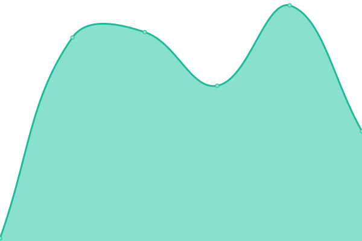 87ms
     
 | 

<a href="https://upptime.outercore.ai/history/workshop-cluster-ipfs-io">100.00%</a>
    

|  [wrtc-star1.par.dwebops.pub](https://wrtc-star1.par.dwebops.pub) | 🟥 Down | [wrtc-star1-par-dwebops-pub.yml](https://github.com/protocol/upptime-pln/commits/HEAD/history/wrtc-star1-par-dwebops-pub.yml) | 

 0ms
     
 | 

<a href="https://upptime.outercore.ai/history/wrtc-star1-par-dwebops-pub">100.00%</a>
    

|  [wrtc-star2.sjc.dwebops.pub](https://wrtc-star2.sjc.dwebops.pub) | 🟥 Down | [wrtc-star2-sjc-dwebops-pub.yml](https://github.com/protocol/upptime-pln/commits/HEAD/history/wrtc-star2-sjc-dwebops-pub.yml) | 

 0ms
     
 | 

<a href="https://upptime.outercore.ai/history/wrtc-star2-sjc-dwebops-pub">100.00%</a>
    

|  [www.filecoin-goldenretriever.io](https://www.filecoin-goldenretriever.io) | 🟩 Up | [www-filecoin-goldenretriever-io.yml](https://github.com/protocol/upptime-pln/commits/HEAD/history/www-filecoin-goldenretriever-io.yml) | 

 914ms
     
 | 

<a href="https://upptime.outercore.ai/history/www-filecoin-goldenretriever-io">99.61%</a>
    

|  [www.filstation.app](https://www.filstation.app) | 🟩 Up | [www-filstation-app.yml](https://github.com/protocol/upptime-pln/commits/HEAD/history/www-filstation-app.yml) | 

 360ms
     
 | 

<a href="https://upptime.outercore.ai/history/www-filstation-app">100.00%</a>
    

|  [www.ipc.space](https://www.ipc.space) | 🟩 Up | [www-ipc-space.yml](https://github.com/protocol/upptime-pln/commits/HEAD/history/www-ipc-space.yml) | 

 690ms
     
 | 

<a href="https://upptime.outercore.ai/history/www-ipc-space">100.00%</a>
    

|  [www.ipfs.io](https://www.ipfs.io) | 🟩 Up | [www-ipfs-io.yml](https://github.com/protocol/upptime-pln/commits/HEAD/history/www-ipfs-io.yml) | 

 162ms
     
 | 

<a href="https://upptime.outercore.ai/history/www-ipfs-io">0.00%</a>
    

|  [www.plnetwork.io](https://www.plnetwork.io) | 🟩 Up | [www-plnetwork-io.yml](https://github.com/protocol/upptime-pln/commits/HEAD/history/www-plnetwork-io.yml) | 

 135ms
     
 | 

<a href="https://upptime.outercore.ai/history/www-plnetwork-io">100.00%</a>
    

|  [zh.wikipedia-on-ipfs.org](https://zh.wikipedia-on-ipfs.org) | 🟩 Up | [zh-wikipedia-on-ipfs-org.yml](https://github.com/protocol/upptime-pln/commits/HEAD/history/zh-wikipedia-on-ipfs-org.yml) | 

 88ms
     
 | 

<a href="https://upptime.outercore.ai/history/zh-wikipedia-on-ipfs-org">100.00%</a>
    

<!--end: status pages-->

[**Visit our status website →**](https://upptime.outercore.ai)

## 📄 License

- Powered by: [Upptime](https://github.com/upptime/upptime)
- Code: [MIT](./LICENSE) © [chase.fil](https://upptime.outercore.ai)
- Data in the `./history` directory: [Open Database License](https://opendatacommons.org/licenses/odbl/1-0/)
