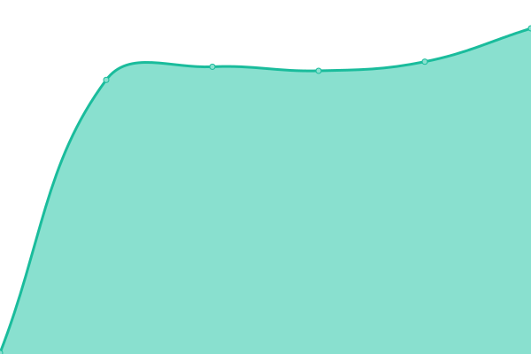
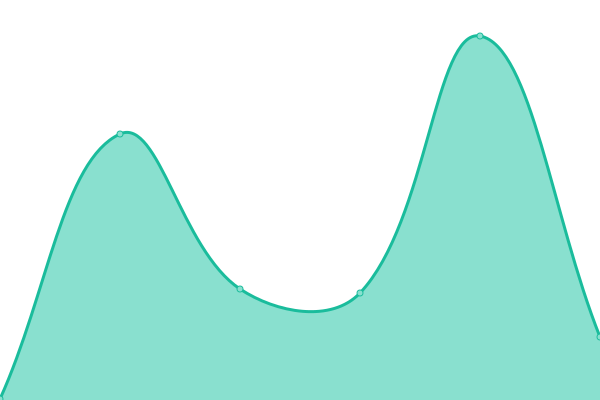

# [📈 Live Status](https://upptime.outercore.ai): <!--live status--> **🟩 All systems operational**

This repository contains the open-source uptime monitor and status page for [Protocol Labs](https://upptime.outercore.ai), powered by [Upptime](https://github.com/upptime/upptime).

The [Airtable Interface](https://airtable.com/invite/l?inviteId=invVgVQUtAq60QRrA&inviteToken=db142bb642208b5ba9943e1c02ddb083db68ceef4bf45667fa7a2dd17c136b48&utm_medium=email&utm_source=product_team&utm_content=transactional-alerts) can be used to create a Pull Request to Add or Omit monitoring for specific sites, as well as to add your Github handle to receive notifications for specific sites. Please check the [Upptime Configuration](https://upptime.js.org/docs/configuration) docs for more advanced config options, some of which are included in the Airtable interface.

Do not add sites that do not exist in Airtable. They will be overwritten by an automated flow that happens weekly (currently) which collects known active domains via API. Open an issue, or contact @vesahc (@chase.fil on Slack) if you would like to add additional data sources.

Global notifications are posted to the [#upptime-pln](https://filecoinproject.slack.com/archives/C05NN527TS7) channel on Filecoin Slack.

With [Upptime](https://upptime.js.org), you can get your own unlimited and free uptime monitor and status page, powered entirely by a GitHub repository. We use [Issues](https://github.com/vesahc/upptime-pln/issues) as incident reports, [Actions](https://github.com/vesahc/upptime-pln/actions) as uptime monitors, and [Pages](https://upptime.outercore.ai) for the status page.

<!--start: status pages-->
<!-- This summary is generated by Upptime (https://github.com/upptime/upptime) -->
<!-- Do not edit this manually, your changes will be overwritten -->
<!-- prettier-ignore -->
| URL | Status | History | Response Time | Uptime |
| --- | ------ | ------- | ------------- | ------ |
|  [www.atlas.storage](https://www.atlas.storage) | 🟩 Up | [www-atlas-storage.yml](https://github.com/protocol/upptime-pln/commits/HEAD/history/www-atlas-storage.yml) | 

 309ms
     
 | 

<a href="https://upptime.outercore.ai/history/www-atlas-storage">100.00%</a>
    

|  [www.buildingweb3.com](https://www.buildingweb3.com) | 🟩 Up | [www-buildingweb3-com.yml](https://github.com/protocol/upptime-pln/commits/HEAD/history/www-buildingweb3-com.yml) | 

 0ms
     
 | 

<a href="https://upptime.outercore.ai/history/www-buildingweb3-com">100.00%</a>
    

|  [www.cod.cloud](https://www.cod.cloud) | 🟩 Up | [www-cod-cloud.yml](https://github.com/protocol/upptime-pln/commits/HEAD/history/www-cod-cloud.yml) | 

 243ms
     
 | 

<a href="https://upptime.outercore.ai/history/www-cod-cloud">100.00%</a>
    

|  [www.cryptoeconlab.io](https://www.cryptoeconlab.io) | 🟩 Up | [www-cryptoeconlab-io.yml](https://github.com/protocol/upptime-pln/commits/HEAD/history/www-cryptoeconlab-io.yml) | 

 0ms
     
 | 

<a href="https://upptime.outercore.ai/history/www-cryptoeconlab-io">100.00%</a>
    

|  [www.drand.love](https://www.drand.love) | 🟩 Up | [www-drand-love.yml](https://github.com/protocol/upptime-pln/commits/HEAD/history/www-drand-love.yml) | 

 0ms
     
 | 

<a href="https://upptime.outercore.ai/history/www-drand-love">100.00%</a>
    

|  [www.fil.space](https://www.fil.space) | 🟩 Up | [www-fil-space.yml](https://github.com/protocol/upptime-pln/commits/HEAD/history/www-fil-space.yml) | 

 0ms
     
 | 

<a href="https://upptime.outercore.ai/history/www-fil-space">100.00%</a>
    

|  [www.filecoin-goldenretriever.io](https://www.filecoin-goldenretriever.io) | 🟩 Up | [www-filecoin-goldenretriever-io.yml](https://github.com/protocol/upptime-pln/commits/HEAD/history/www-filecoin-goldenretriever-io.yml) | 

 376ms
     
 | 

<a href="https://upptime.outercore.ai/history/www-filecoin-goldenretriever-io">100.00%</a>
    

|  [www.filecoin.io](https://www.filecoin.io) | 🟩 Up | [www-filecoin-io.yml](https://github.com/protocol/upptime-pln/commits/HEAD/history/www-filecoin-io.yml) | 

 0ms
     
 | 

<a href="https://upptime.outercore.ai/history/www-filecoin-io">100.00%</a>
    

|  [www.filecoingreen.io](https://www.filecoingreen.io) | 🟩 Up | [www-filecoingreen-io.yml](https://github.com/protocol/upptime-pln/commits/HEAD/history/www-filecoingreen-io.yml) | 

 0ms
     
 | 

<a href="https://upptime.outercore.ai/history/www-filecoingreen-io">100.00%</a>
    

|  [www.filstation.app](https://www.filstation.app) | 🟩 Up | [www-filstation-app.yml](https://github.com/protocol/upptime-pln/commits/HEAD/history/www-filstation-app.yml) | 

 300ms
     
 | 

<a href="https://upptime.outercore.ai/history/www-filstation-app">100.00%</a>
    

|  [www.ipc.space](https://www.ipc.space) | 🟩 Up | [www-ipc-space.yml](https://github.com/protocol/upptime-pln/commits/HEAD/history/www-ipc-space.yml) | 

 0ms
     
 | 

<a href="https://upptime.outercore.ai/history/www-ipc-space">100.00%</a>
    

|  [www.ipfs.io](https://www.ipfs.io) | 🟩 Up | [www-ipfs-io.yml](https://github.com/protocol/upptime-pln/commits/HEAD/history/www-ipfs-io.yml) | 

 324ms
     
 | 

<a href="https://upptime.outercore.ai/history/www-ipfs-io">100.00%</a>
    

|  [www.ipfs.network](https://www.ipfs.network) | 🟩 Up | [www-ipfs-network.yml](https://github.com/protocol/upptime-pln/commits/HEAD/history/www-ipfs-network.yml) | 

 0ms
     
 | 

<a href="https://upptime.outercore.ai/history/www-ipfs-network">100.00%</a>
    

|  [www.ipfs.tech](https://www.ipfs.tech) | 🟩 Up | [www-ipfs-tech.yml](https://github.com/protocol/upptime-pln/commits/HEAD/history/www-ipfs-tech.yml) | 

 0ms
     
 | 

<a href="https://upptime.outercore.ai/history/www-ipfs-tech">100.00%</a>
    

|  [www.ipfspinningsummit.com](https://www.ipfspinningsummit.com) | 🟩 Up | [www-ipfspinningsummit-com.yml](https://github.com/protocol/upptime-pln/commits/HEAD/history/www-ipfspinningsummit-com.yml) | 

 0ms
     
 | 

<a href="https://upptime.outercore.ai/history/www-ipfspinningsummit-com">100.00%</a>
    

|  [www.lilium.sh](https://www.lilium.sh) | 🟩 Up | [www-lilium-sh.yml](https://github.com/protocol/upptime-pln/commits/HEAD/history/www-lilium-sh.yml) | 

 0ms
     
 | 

<a href="https://upptime.outercore.ai/history/www-lilium-sh">100.00%</a>
    

|  [www.microgen.site](https://www.microgen.site) | 🟩 Up | [www-microgen-site.yml](https://github.com/protocol/upptime-pln/commits/HEAD/history/www-microgen-site.yml) | 

 0ms
     
 | 

<a href="https://upptime.outercore.ai/history/www-microgen-site">100.00%</a>
    

|  [www.mosaia.io](https://www.mosaia.io) | 🟩 Up | [www-mosaia-io.yml](https://github.com/protocol/upptime-pln/commits/HEAD/history/www-mosaia-io.yml) | 

 1064ms
     
 | 

<a href="https://upptime.outercore.ai/history/www-mosaia-io">100.00%</a>
    

|  [www.multiformats.io](https://www.multiformats.io) | 🟩 Up | [www-multiformats-io.yml](https://github.com/protocol/upptime-pln/commits/HEAD/history/www-multiformats-io.yml) | 

 0ms
     
 | 

<a href="https://upptime.outercore.ai/history/www-multiformats-io">100.00%</a>
    

|  [www.nftschool.dev](https://www.nftschool.dev) | 🟩 Up | [www-nftschool-dev.yml](https://github.com/protocol/upptime-pln/commits/HEAD/history/www-nftschool-dev.yml) | 

 0ms
     
 | 

<a href="https://upptime.outercore.ai/history/www-nftschool-dev">100.00%</a>
    

|  [www.pl-launchpad.io](https://www.pl-launchpad.io) | 🟩 Up | [www-pl-launchpad-io.yml](https://github.com/protocol/upptime-pln/commits/HEAD/history/www-pl-launchpad-io.yml) | 

 0ms
     
 | 

<a href="https://upptime.outercore.ai/history/www-pl-launchpad-io">100.00%</a>
    

|  [www.plnetwork.io](https://www.plnetwork.io) | 🟩 Up | [www-plnetwork-io.yml](https://github.com/protocol/upptime-pln/commits/HEAD/history/www-plnetwork-io.yml) | 

 1573ms
     
 | 

<a href="https://upptime.outercore.ai/history/www-plnetwork-io">100.00%</a>
    

|  [www.protocol.ai](https://www.protocol.ai) | 🟩 Up | [www-protocol-ai.yml](https://github.com/protocol/upptime-pln/commits/HEAD/history/www-protocol-ai.yml) | 

 0ms
     
 | 

<a href="https://upptime.outercore.ai/history/www-protocol-ai">100.00%</a>
    

|  [www.saft-project.com](https://www.saft-project.com) | 🟩 Up | [www-saft-project-com.yml](https://github.com/protocol/upptime-pln/commits/HEAD/history/www-saft-project-com.yml) | 

 0ms
     
 | 

<a href="https://upptime.outercore.ai/history/www-saft-project-com">100.00%</a>
    

|  [www.saft-project.org](https://www.saft-project.org) | 🟩 Up | [www-saft-project-org.yml](https://github.com/protocol/upptime-pln/commits/HEAD/history/www-saft-project-org.yml) | 

 0ms
     
 | 

<a href="https://upptime.outercore.ai/history/www-saft-project-org">100.00%</a>
    

|  [www.saftproject.com](https://www.saftproject.com) | 🟩 Up | [www-saftproject-com.yml](https://github.com/protocol/upptime-pln/commits/HEAD/history/www-saftproject-com.yml) | 

 0ms
     
 | 

<a href="https://upptime.outercore.ai/history/www-saftproject-com">0.00%</a>
    

|  [www.singularity.storage](https://www.singularity.storage) | 🟩 Up | [www-singularity-storage.yml](https://github.com/protocol/upptime-pln/commits/HEAD/history/www-singularity-storage.yml) | 

 0ms
     
 | 

<a href="https://upptime.outercore.ai/history/www-singularity-storage">0.00%</a>
    

<!--end: status pages-->

[**Visit our status website →**](https://upptime.outercore.ai)

## 📄 License

- Powered by: [Upptime](https://github.com/upptime/upptime)
- Code: [MIT](./LICENSE) © [chase.fil](https://upptime.outercore.ai)
- Data in the `./history` directory: [Open Database License](https://opendatacommons.org/licenses/odbl/1-0/)
